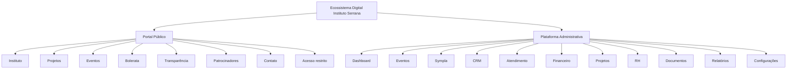
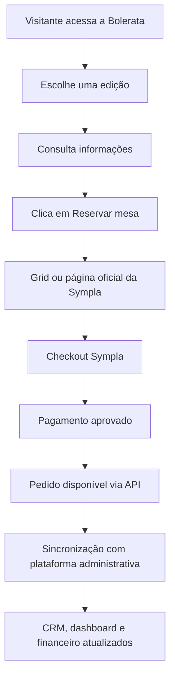
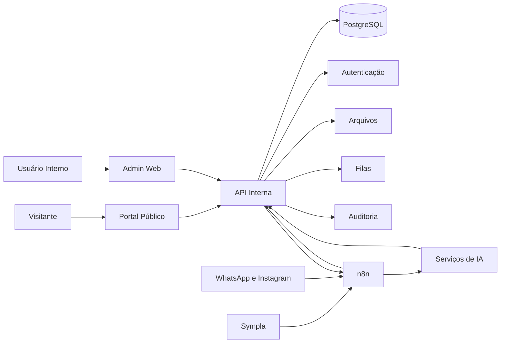
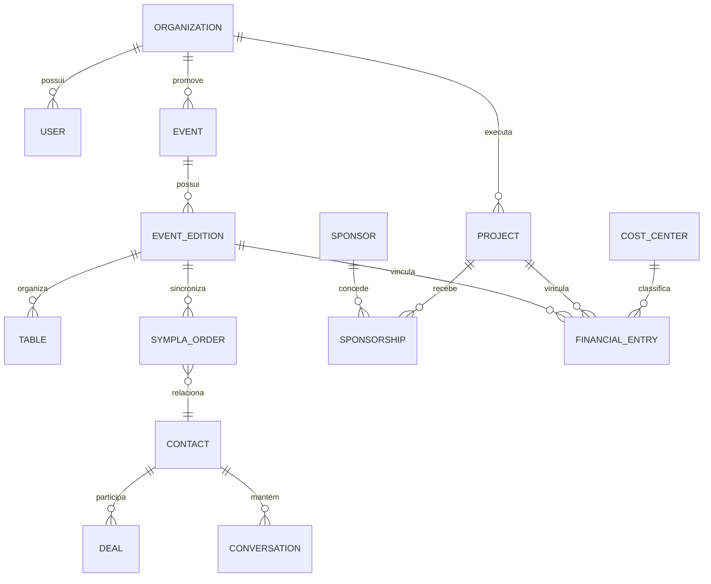
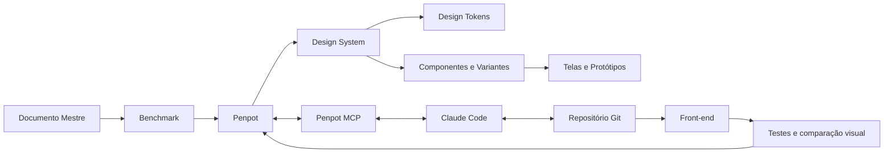

# Plataforma Instituto Serrana & Bolerata

## Documento Mestre de Estrutura Funcional, Visual e Técnica

> **Finalidade deste documento:** consolidar, em uma única referência, a visão do produto, a experiência pública, a plataforma administrativa, a arquitetura técnica, as integrações, os requisitos de segurança, os fluxos operacionais e o plano de implementação da plataforma digital do Instituto Serrana e da Bolerata.

Este documento deverá ser tratado como a **fonte principal de alinhamento do projeto**. Novas decisões, correções, alterações de escopo e validações do cliente devem ser incorporadas aqui, evitando fragmentação de informações em documentos paralelos.

---

# 1. Identificação do projeto

## 1.1. Nome provisório

**Plataforma Instituto Serrana & Bolerata**

Possível nome de produto interno:

- Serrana Hub;
- Instituto Serrana Digital;
- Serrana Cultura;
- Serrana Gestão Cultural.

> O nome comercial definitivo deverá ser validado com o Instituto antes da publicação.

## 1.2. Organizações envolvidas

| Parte | Papel no projeto |
|---|---|
| Instituto Serrana | Contratante, controlador institucional, responsável pelo conteúdo e pelas regras de negócio |
| Bolerata | Evento cultural e primeiro grande caso de uso da plataforma |
| Agência AR | Planejamento, design, desenvolvimento, integrações, automações, suporte e evolução tecnológica |
| Sympla | Plataforma externa de venda, emissão e gestão de ingressos, conforme contrato do Instituto |
| Meta | Infraestrutura de WhatsApp e Instagram para atendimento e automações |
| Prestadores e parceiros | Contabilidade, produção cultural, fornecedores, patrocinadores, artistas e equipe operacional |

## 1.3. Problema central

Atualmente, informações institucionais, vendas, contatos, reservas, pagamentos, documentos, projetos, patrocinadores e atividades administrativas podem permanecer distribuídos entre ferramentas distintas, planilhas, mensagens e processos manuais.

A plataforma deverá reunir essas operações em um ecossistema digital integrado, com:

1. presença institucional pública;
2. divulgação de projetos e eventos;
3. experiência pública da Bolerata;
4. integração com a Sympla;
5. CRM de relacionamento;
6. atendimento por WhatsApp e Instagram;
7. automações com inteligência artificial;
8. gestão financeira;
9. gestão de projetos e patrocinadores;
10. prestação de contas;
11. recursos humanos;
12. documentos, relatórios e auditoria.

---

# 2. Visão do produto

## 2.1. Proposta

Construir uma plataforma web responsiva, com experiência adequada para desktop, tablet e celular, composta por dois ambientes independentes e integrados:

1. **Portal público institucional e cultural**;
2. **Plataforma administrativa de acesso restrito**.

## 2.2. Princípio estrutural



## 2.3. Objetivo estratégico

A plataforma deverá tornar-se a camada central de:

- comunicação pública;
- gestão institucional;
- inteligência operacional;
- relacionamento com o público;
- consolidação financeira;
- acompanhamento dos eventos;
- gestão de parceiros e patrocinadores;
- produção de relatórios;
- memória organizacional.

---

# 3. Escopo geral

## 3.1. Ambiente público

O portal público será o espaço de apresentação do Instituto, de seus projetos e eventos. Também será o ponto inicial da jornada de reserva e compra da Bolerata.

Principais áreas:

- página inicial;
- o Instituto;
- história;
- missão, visão e valores;
- áreas de atuação;
- projetos;
- eventos;
- Bolerata;
- agenda cultural;
- patrocinadores;
- transparência;
- notícias;
- contato;
- política de privacidade;
- área de acesso restrito.

## 3.2. Ambiente administrativo

O ambiente administrativo será utilizado por diretoria, equipe de eventos, atendimento, financeiro, projetos, recursos humanos, contabilidade e demais usuários autorizados.

Principais módulos:

- dashboard;
- gestão de eventos;
- integração Sympla;
- gestão operacional de mesas;
- CRM;
- atendimento omnichannel;
- inteligência artificial;
- financeiro;
- projetos;
- patrocinadores;
- prestação de contas;
- recursos humanos;
- documentos;
- relatórios;
- usuários e permissões;
- configurações;
- auditoria.

---

# 4. Arquitetura de navegação

## 4.1. Estrutura recomendada de domínios

| Endereço | Finalidade |
|---|---|
| `www.institutoserrana.org.br` | Portal público |
| `app.institutoserrana.org.br` | Plataforma administrativa |
| `www.institutoserrana.org.br/eventos/bolerata` | Página pública da Bolerata |
| `www.institutoserrana.org.br/eventos/bolerata/{edicao}` | Página de uma edição |
| `www.institutoserrana.org.br/transparencia` | Transparência institucional |
| `www.institutoserrana.org.br/contato` | Contato |

> O domínio definitivo deverá ser validado e configurado após confirmação do Instituto.

## 4.2. Menu público

- Início;
- O Instituto;
- Projetos;
- Eventos;
- Bolerata;
- Transparência;
- Patrocine;
- Notícias;
- Contato;
- Área do Instituto.

## 4.3. Navegação administrativa

- Visão geral;
- Eventos;
- Bolerata;
- Vendas e reservas;
- Sympla;
- CRM;
- Atendimento;
- Financeiro;
- Projetos;
- Patrocinadores;
- Prestação de contas;
- Pessoas e RH;
- Documentos;
- Relatórios;
- Integrações;
- Usuários e permissões;
- Auditoria;
- Configurações.

---

# 5. Experiência pública da página inicial

## 5.1. Conceito narrativo

A página inicial deverá começar na parte inferior da escadaria da Igreja de Santa Rita, no Serro, com a igreja visível ao fundo e centralizada no alto.

Conforme o visitante rolar a página, a câmera avançará e subirá progressivamente pela escadaria até chegar diante da igreja.

A experiência representará a seguinte jornada:

```text
Cidade → Comunidade → Memória → Cultura → Patrimônio → Instituto
```

A escadaria será utilizada como estrutura narrativa, e não apenas como efeito decorativo.

## 5.2. Direção visual

A experiência deverá transmitir:

- pertencimento;
- identidade serrana;
- memória;
- patrimônio;
- cultura;
- movimento;
- continuidade;
- valorização territorial.

A igreja deve permanecer como ponto focal durante todo o trajeto.

## 5.3. Cena 1 — Base da escadaria

### Composição

- visão ampla da parte inferior;
- jardins visíveis;
- arquitetura colonial nas laterais;
- escadaria central;
- igreja ao fundo;
- profundidade suficiente para evidenciar o percurso.

### Texto inicial provisório

```text
INSTITUTO SERRANA

Cultura, memória e desenvolvimento
no coração do Serro.
```

Texto complementar:

```text
Percorra nossa história e conheça as iniciativas
que mantêm viva a identidade serrana.
```

Ações:

- Iniciar percurso;
- Conheça o Instituto;
- Ver eventos.

Indicador:

```text
Role para subir
```

## 5.4. Cena 2 — Entrada na escadaria

Comportamentos:

- desaparecimento suave do texto inicial;
- avanço até os primeiros degraus;
- manutenção da igreja no eixo central;
- início da narrativa;
- cabeçalho transparente;
- progressão visual discreta.

Texto:

```text
Cada degrau guarda uma história.
```

## 5.5. Cena 3 — Primeira parte da subida

Texto sugerido:

```text
Uma história construída por pessoas,
tradições e gerações.
```

Palavras de apoio:

- Memória;
- Cultura;
- Patrimônio;
- Comunidade.

Esses elementos devem surgir com moderação e nunca cobrir a igreja.

## 5.6. Cena 4 — Meio da escadaria

Texto provisório:

```text
Valorizamos a cultura e as manifestações
que formam a identidade do Serro.
```

Complemento:

```text
Por meio de projetos, eventos e parcerias,
aproximamos pessoas, patrimônio e desenvolvimento.
```

> Esses textos devem ser substituídos ou aprovados após análise do estatuto, da missão oficial e dos documentos institucionais.

## 5.7. Cena 5 — Aproximação da igreja

Nos últimos degraus:

- reduzir a velocidade;
- ampliar o caráter contemplativo;
- diminuir interferências gráficas;
- aumentar gradualmente a presença institucional.

Texto sequencial:

```text
Preservar o passado.
Mobilizar o presente.
Construir novos caminhos.
```

## 5.8. Cena 6 — Chegada frontal

Ao final da subida, a câmera deverá estabilizar-se diante da igreja.

Texto institucional:

```text
INSTITUTO SERRANA

Serro: memória viva, cultura em movimento.
```

Complemento:

```text
Conheça as iniciativas que conectam patrimônio,
comunidade, música, turismo e desenvolvimento cultural.
```

Ações:

- Conheça nossa atuação;
- Explore os projetos;
- Ver próximos eventos.

## 5.9. Cena 7 — Transição para o conteúdo

A imagem da igreja permanece estabilizada enquanto o conteúdo institucional sobe pela parte inferior da tela.

Título da próxima seção:

```text
Conheça o Instituto Serrana
```

A câmera não deve simular entrada física na igreja, evitando interpretação de que o Instituto funciona naquele local.

## 5.10. Distribuição da rolagem

| Progresso | Etapa |
|---:|---|
| 0%–15% | Base da escadaria e introdução |
| 15%–30% | Aproximação dos primeiros degraus |
| 30%–50% | Primeira parte da subida |
| 50%–70% | Meio da escadaria e apresentação institucional |
| 70%–88% | Aproximação da igreja |
| 88%–100% | Chegada frontal e identidade do Instituto |

A seção deve ser concluída com aproximadamente quatro a seis movimentos naturais da roda do mouse.

## 5.11. Cabeçalho durante o efeito

### Durante a subida

- transparente;
- logomarca clara;
- navegação reduzida;
- texto branco ou marfim;
- botão “Área do Instituto” discreto.

### Após a subida

- fundo sólido ou semitransparente;
- navegação fixa;
- contraste ampliado;
- adoção da paleta institucional.

## 5.12. Mobile

No celular, preservar o conceito com menor complexidade:

```text
Base → Início da subida → Meio → Aproximação → Igreja
```

Requisitos:

- vídeo vertical;
- textos reduzidos;
- menos sobreposições;
- menor duração;
- carregamento adaptativo;
- imagem estática de fallback;
- botão administrativo no menu lateral.

## 5.13. Acessibilidade

Para usuários com redução de movimento:

- desativar animação vinculada à rolagem;
- mostrar imagem estática;
- manter conteúdo e botões;
- garantir navegação pelo teclado;
- assegurar contraste;
- disponibilizar texto alternativo.

---

# 6. Produção audiovisual

## 6.1. Material ideal para desktop

| Requisito | Especificação |
|---|---|
| Orientação | Horizontal |
| Proporção | 16:9 |
| Resolução | 3840 × 2160 |
| Movimento | Base da escadaria até a igreja |
| Duração bruta | 20 a 40 segundos |
| Câmera | Centralizada e estabilizada |
| Áudio | Sem música incorporada |
| Marca d’água | Não permitida |
| Iluminação | Uniforme |
| Pessoas e veículos | Evitar elementos próximos à câmera |

## 6.2. Material ideal para mobile

| Requisito | Especificação |
|---|---|
| Orientação | Vertical |
| Proporção | 9:16 |
| Resolução | 1080 × 1920 |
| Ponto focal | Igreja em área central segura |
| Movimento | Contínuo e estabilizado |
| Cortes | Evitar cortes bruscos |

## 6.3. Uso dos materiais atuais

Os materiais já reunidos podem ser utilizados para:

- referência;
- storyboard;
- protótipo Penpot;
- prova de conceito;
- teste mobile;
- apresentação preliminar.

Para publicação definitiva, recomenda-se material próprio em alta resolução e sem marcas d’água.

---

# 7. Seções públicas posteriores ao hero

## 7.1. O Instituto

Conteúdos:

- apresentação;
- história;
- missão;
- visão;
- valores;
- dirigentes;
- território de atuação;
- documentos institucionais;
- contatos.

## 7.2. Áreas de atuação

Possíveis áreas, sujeitas a validação:

- cultura;
- patrimônio;
- turismo;
- música;
- formação;
- desenvolvimento local;
- projetos sociais;
- produção de eventos.

## 7.3. Projetos

Cada projeto poderá possuir:

- título;
- descrição;
- objetivos;
- público;
- período;
- situação;
- equipe;
- parceiros;
- patrocinadores;
- galeria;
- indicadores;
- resultados;
- documentos públicos;
- chamada para apoio.

## 7.4. Agenda e eventos

- calendário;
- filtros;
- eventos futuros;
- eventos anteriores;
- página de cada evento;
- local;
- data;
- horário;
- programação;
- acessibilidade;
- regulamento;
- patrocinadores;
- compra ou inscrição.

## 7.5. Patrocinadores

- apresentação das marcas;
- modalidade de parceria;
- projeto apoiado;
- contrapartidas;
- chamada para patrocínio;
- formulário de interesse.

## 7.6. Transparência

- estatuto;
- atas;
- relatórios;
- prestações de contas;
- projetos;
- convênios;
- termos de parceria;
- demonstrativos;
- políticas;
- documentos públicos.

## 7.7. Notícias

- notícias institucionais;
- registros de eventos;
- resultados;
- chamadas;
- imprensa;
- atualizações de projetos.

## 7.8. Contato

- formulário;
- WhatsApp;
- e-mail;
- Instagram;
- endereço;
- mapa;
- horário;
- consentimentos de privacidade.

---

# 8. Página pública da Bolerata

## 8.1. Objetivo

Criar uma página temática própria dentro do portal, alinhada à identidade preta, dourada e musical da Bolerata.

## 8.2. Estrutura

1. hero da temporada;
2. próxima edição;
3. história do evento;
4. programação;
5. locais;
6. artistas;
7. temporadas;
8. galeria;
9. patrocinadores;
10. perguntas frequentes;
11. orientações;
12. reserva ou compra.

## 8.3. Página de uma edição

Campos:

- nome;
- data;
- horário;
- local;
- endereço;
- mapa;
- programação;
- artistas;
- capacidade;
- setores;
- informações de reserva;
- acessibilidade;
- orientações;
- política de cancelamento;
- patrocinadores;
- botão de compra;
- contato.

## 8.4. Jornada de reserva



## 8.5. Mensagem de transição

Antes do redirecionamento:

```text
A seleção da mesa e a conclusão do pagamento
serão realizadas com segurança no ambiente da Sympla.
```

---

# 9. Integração com a Sympla

## 9.1. Premissa atual

Com base na documentação pública analisada:

- a API pública é majoritariamente de leitura;
- permite consultar eventos, pedidos e participantes;
- permite check-in de ingresso já emitido;
- não possui endpoint público para criar pedido;
- não processa pagamento externo;
- não bloqueia mesas ou assentos;
- não oferece checkout white-label público;
- o grid incorporado inicia a compra, mas o checkout abre na Sympla;
- o lugar marcado é operado pela Sympla/Bileto.

## 9.2. Decisão inicial

Na primeira etapa:

> **A Sympla será a fonte oficial da venda, do pagamento e da emissão do ingresso. A plataforma própria será a fonte central de gestão, relacionamento, consolidação e inteligência.**

## 9.3. Responsabilidades

| Função | Sistema principal |
|---|---|
| Criação oficial do evento | Sympla |
| Mapa oficial de lugares | Sympla/Bileto, se contratado |
| Bloqueio de assento | Sympla |
| Pagamento | Sympla |
| Emissão do ingresso | Sympla |
| Pedido oficial | Sympla |
| CRM | Plataforma própria |
| Atendimento | Plataforma própria |
| Consolidação financeira | Plataforma própria |
| Indicadores e relatórios | Plataforma própria |
| Projetos e patrocínios | Plataforma própria |
| Documentos institucionais | Plataforma própria |

## 9.4. Dados a sincronizar

- eventos;
- sessões;
- pedidos;
- compradores;
- participantes;
- ingressos;
- valores;
- taxas;
- situação do pedido;
- cancelamentos;
- check-ins;
- setores;
- lugares, quando expostos pela API;
- afiliados;
- identificadores externos.

## 9.5. Estratégia de sincronização

Inicialmente:

- sincronização programada pelo n8n;
- carga incremental;
- registro da última atualização;
- fila de falhas;
- repetição automática;
- reconciliação manual;
- logs de integração;
- alertas administrativos.

Caso a Sympla disponibilize webhooks ou contrato especial, a arquitetura poderá migrar para sincronização orientada a eventos.

## 9.6. Mapa de mesas

### Cenário A — Sympla/Bileto

- mapa oficial na Sympla;
- compra na Sympla;
- sistema próprio exibe informações administrativas importadas.

### Cenário B — Mapa próprio ilustrativo

- planta visual para comunicação;
- sem garantia de disponibilidade em tempo real;
- botão direciona à Sympla.

### Cenário C — Venda própria futura

- mapa próprio;
- bloqueio temporário;
- carrinho;
- Pix e cartão;
- ingresso próprio;
- QR Code;
- check-in;
- reembolso;
- conciliação.

Esse cenário dependerá de decisão estratégica e contratual.

## 9.7. Questões a obter por escrito da Sympla

1. Existe API privada para criação de pedidos?
2. Existe API para bloqueio de mesa ou assento?
3. Existe checkout white-label?
4. Existe integração de mapa de lugares?
5. Existe webhook de pedido e cancelamento?
6. O Instituto é elegível a condições de entidade sem fins lucrativos?
7. Quais taxas se aplicam?
8. Quais dados podem ser armazenados localmente?
9. Existem restrições de marca?
10. Existem cláusulas de exclusividade?
11. Como funcionam reembolsos?
12. Qual a política de uso dos dados dos compradores?

---

# 10. Plataforma administrativa

## 10.1. Login

Requisitos:

- autenticação por e-mail;
- recuperação de senha;
- autenticação multifator para perfis sensíveis;
- proteção contra tentativas repetidas;
- registro de sessão;
- aceite de termos internos;
- redirecionamento conforme perfil.

## 10.2. Dashboard executivo

Indicadores:

- faturamento bruto;
- receita líquida;
- taxas;
- despesas;
- resultado;
- mesas ou ingressos vendidos;
- ocupação;
- pedidos pendentes;
- contas a pagar;
- contas a receber;
- patrocinadores;
- campanhas;
- conversas abertas;
- próximas tarefas;
- próximos eventos;
- alertas;
- falhas de integração.

Filtros:

- período;
- projeto;
- evento;
- edição;
- centro de custo;
- canal;
- situação.

## 10.3. Gestão de eventos

Funcionalidades:

- cadastro de temporadas;
- cadastro de eventos;
- cadastro de edições;
- locais;
- setores;
- programação;
- artistas;
- fornecedores;
- equipe;
- documentos;
- contratos;
- checklists;
- cronograma;
- tarefas;
- custos;
- receitas;
- patrocinadores;
- relatórios.

## 10.4. Gestão operacional de mesas

O sistema poderá manter uma planta administrativa própria para acompanhamento interno.

Estados:

| Cor | Situação |
|---|---|
| Verde | Disponível |
| Âmbar | Reserva interna ou acompanhamento |
| Vermelho | Vendida |
| Azul | Cortesia, patrocinador ou convidado |
| Cinza | Bloqueada |
| Roxo | Check-in realizado |

Dados por mesa:

- número;
- setor;
- capacidade;
- preço;
- comprador;
- participantes;
- canal;
- pedido Sympla;
- situação;
- pagamento;
- observações;
- histórico;
- responsável;
- check-in.

> A disponibilidade real deve respeitar a fonte oficial da venda. Não permitir venda paralela que provoque conflito com a Sympla.

## 10.5. CRM

### Pipeline principal

```text
Novo contato
→ Atendimento iniciado
→ Interesse identificado
→ Edição selecionada
→ Opções apresentadas
→ Link da Sympla enviado
→ Aguardando compra
→ Compra identificada
→ Venda concluída
→ Pós-venda
→ Check-in
→ Relacionamento futuro
```

Situações complementares:

- sem interesse;
- contato inválido;
- desistência;
- pagamento cancelado;
- reembolso;
- reserva expirada;
- atendimento humano necessário.

### Dados do contato

- nome;
- telefone;
- WhatsApp;
- Instagram;
- e-mail;
- cidade;
- origem;
- tags;
- consentimentos;
- histórico;
- compras;
- edição de interesse;
- atendente;
- próxima ação;
- observações.

## 10.6. Atendimento omnichannel

Canais previstos:

- WhatsApp;
- Instagram;
- formulário do site;
- e-mail;
- atendimento manual.

Tela unificada:

- lista de conversas;
- filtros;
- contato;
- histórico;
- resumo por IA;
- etapa do CRM;
- edição de interesse;
- pedido;
- mesa;
- tarefas;
- respostas rápidas;
- transferência;
- notas internas;
- anexos.

## 10.7. Inteligência artificial

Capacidades:

- explicar o Instituto;
- informar datas;
- explicar a Bolerata;
- apresentar locais e horários;
- responder perguntas frequentes;
- identificar edição de interesse;
- coletar dados;
- criar contato;
- atualizar CRM;
- enviar link correto;
- lembrar o cliente;
- resumir conversa;
- sugerir resposta;
- encaminhar para humano;
- classificar intenção;
- gerar relatórios.

Restrições:

- não conceder desconto;
- não alterar preço;
- não aprovar reembolso;
- não movimentar dinheiro;
- não emitir nota sem validação;
- não bloquear mesa indefinidamente;
- não assumir decisão jurídica;
- não responder situação sensível sem revisão.

## 10.8. Financeiro

### Centros de custo

- Instituto Serrana;
- Bolerata;
- projetos culturais;
- patrocínios;
- doações;
- administração;
- eventos específicos.

### Contas a receber

- venda;
- patrocínio;
- doação;
- prestação de serviço;
- repasse;
- convênio;
- outras receitas.

### Contas a pagar

- artistas;
- músicos;
- produção;
- brigadistas;
- sonorização;
- iluminação;
- locação;
- comunicação;
- alimentação;
- transporte;
- fornecedores;
- tributos;
- serviços administrativos.

### Dados

- descrição;
- categoria;
- centro de custo;
- competência;
- vencimento;
- pagamento;
- favorecido;
- conta;
- valor;
- comprovante;
- nota fiscal;
- projeto;
- evento;
- edição;
- situação;
- observações.

## 10.9. Documentos fiscais

- status da nota;
- número;
- tomador;
- prestador;
- serviço;
- valor;
- PDF;
- XML;
- comprovante;
- data de emissão;
- vínculo financeiro;
- contrato;
- evento.

A automatização da emissão dependerá do sistema fiscal utilizado e de validação contábil.

## 10.10. Projetos e patrocínios

Dados por projeto:

- nome;
- objetivo;
- justificativa;
- público;
- equipe;
- orçamento;
- cronograma;
- metas;
- indicadores;
- patrocinadores;
- contrapartidas;
- documentos;
- resultados;
- prestação de contas.

Dados por patrocinador:

- empresa;
- contato;
- projeto;
- valor;
- vigência;
- contrapartidas;
- entregas;
- marca;
- arquivos;
- relatórios;
- situação.

## 10.11. Prestação de contas

- plano de trabalho;
- orçamento;
- desembolsos;
- despesas;
- comprovantes;
- notas;
- contratos;
- relatórios;
- metas;
- resultados;
- pendências;
- documentos públicos;
- documentos restritos.

## 10.12. Recursos humanos

Pessoas:

- funcionários;
- prestadores;
- artistas;
- músicos;
- brigadistas;
- produtores;
- voluntários;
- fornecedores.

Dados:

- função;
- documentos;
- contato;
- contrato;
- início;
- término;
- escala;
- evento;
- valor;
- pagamento;
- equipamentos;
- treinamento;
- situação;
- alertas.

## 10.13. Relatórios

- vendas por edição;
- receita por evento;
- receita por canal;
- ocupação;
- taxa média;
- ticket médio;
- despesas;
- resultado;
- patrocinadores;
- atendimento;
- conversão;
- público;
- check-in;
- projetos;
- metas;
- recursos humanos;
- documentos pendentes;
- auditoria.

Exportações:

- PDF;
- Excel;
- CSV;
- impressão.

---

# 11. Perfis e permissões

| Perfil | Permissões principais |
|---|---|
| Superadministrador | Acesso total |
| Diretoria | Indicadores, aprovações e relatórios |
| Financeiro | Receitas, despesas, documentos e conciliação |
| Eventos | Edições, equipe, fornecedores e operação |
| Comercial | CRM e vendas |
| Atendimento | Conversas e contatos |
| Check-in | Consulta e validação |
| Projetos | Patrocínios e prestação de contas |
| RH | Pessoas, contratos e escalas |
| Contador | Documentos e relatórios financeiros |
| Auditoria | Consulta sem alteração |
| Comunicação | Conteúdo público, notícias e campanhas |

## 11.1. Modelo de autorização

- RBAC por perfil;
- permissões granulares;
- escopo por organização;
- escopo por módulo;
- escopo por centro de custo;
- restrição de dados sensíveis;
- registro de alterações;
- revisão periódica de acessos.

---

# 12. Design system

## 12.1. Princípio

Um único sistema de componentes, com dois temas visuais:

1. tema institucional;
2. tema Bolerata.

## 12.2. Tema institucional

| Token | Cor |
|---|---|
| Marfim | `#F5F0E7` |
| Azul colonial | `#315B70` |
| Terracota | `#A35D42` |
| Verde jardim | `#486A4A` |
| Grafite | `#202321` |
| Dourado antigo | `#A47D38` |

Uso:

- páginas institucionais;
- projetos;
- transparência;
- notícias;
- conteúdo público;
- áreas administrativas claras.

## 12.3. Tema Bolerata

| Token | Cor |
|---|---|
| Preto profundo | `#080808` |
| Grafite | `#171717` |
| Dourado | `#A37C35` |
| Dourado claro | `#C6A35A` |
| Marfim | `#F4F0E7` |

Uso:

- página da Bolerata;
- campanhas;
- temporadas;
- materiais especiais;
- destaques internos do evento.

## 12.4. Tipografia

Sugestão:

- títulos institucionais: Cormorant Garamond ou Marcellus;
- interface: Inter ou Manrope;
- números e relatórios: Inter;
- marca: arquivo vetorial oficial.

## 12.5. Componentes

- botões;
- inputs;
- selects;
- tabelas;
- cards;
- gráficos;
- badges;
- modais;
- drawers;
- tooltips;
- menus;
- breadcrumb;
- navegação lateral;
- navegação mobile;
- estados vazios;
- skeletons;
- alertas;
- notificações;
- mapa de mesas;
- timeline;
- calendário;
- kanban;
- upload de documentos;
- player de mídia;
- painel de conversa.

---

# 13. Front-end

## 13.1. Stack recomendada

- Next.js;
- React;
- TypeScript;
- Tailwind CSS;
- shadcn/ui;
- React Hook Form;
- Zod;
- TanStack Query;
- GSAP;
- ScrollTrigger;
- biblioteca de gráficos;
- PWA;
- testes com Playwright.

## 13.2. Aplicações

Possibilidades:

```text
apps/
  public-web/
  admin-web/
```

Ou uma aplicação com separação de rotas:

```text
app/
  (public)/
  (admin)/
```

Recomendação inicial: duas aplicações no mesmo monorepo, permitindo deploy, segurança e evolução independentes.

## 13.3. Rotas públicas

```text
/
 /instituto
 /atuacao
 /projetos
 /projetos/[slug]
 /eventos
 /eventos/[slug]
 /eventos/bolerata
 /eventos/bolerata/[edicao]
 /transparencia
 /noticias
 /noticias/[slug]
 /patrocine
 /contato
 /privacidade
```

## 13.4. Rotas administrativas

```text
/login
/recuperar-senha
/dashboard
/eventos
/eventos/[id]
/bolerata
/bolerata/edicoes/[id]
/sympla
/crm
/atendimento
/financeiro
/projetos
/patrocinadores
/prestacao-contas
/pessoas
/documentos
/relatorios
/integracoes
/usuarios
/auditoria
/configuracoes
```

## 13.5. Experiência responsiva

Desktop:

- menu lateral;
- dashboards amplos;
- tabelas;
- mapa;
- painéis simultâneos.

Mobile:

- navegação inferior ou drawer;
- cards;
- ações rápidas;
- atendimento;
- check-in;
- CRM simplificado;
- mapa com zoom.

## 13.6. Performance

- carregamento adaptativo de vídeo;
- WebM e MP4;
- lazy loading;
- otimização de imagens;
- cache;
- divisão de código;
- renderização estática quando possível;
- fallback para conexões lentas;
- monitoramento de Web Vitals.

---

# 14. Back-end

## 14.1. Stack recomendada

- Supabase;
- PostgreSQL;
- Supabase Auth;
- Supabase Storage;
- Row Level Security;
- Edge Functions;
- n8n;
- Redis para filas e cache, quando necessário;
- serviços internos em Node.js/TypeScript.

## 14.2. Arquitetura



## 14.3. Domínios de negócio

- identidade e acesso;
- conteúdo público;
- eventos;
- ingressos;
- CRM;
- conversas;
- financeiro;
- projetos;
- patrocinadores;
- pessoas;
- documentos;
- integrações;
- auditoria.

## 14.4. Entidades principais

```text
organizations
workspaces
users
profiles
roles
permissions
user_roles

public_pages
posts
media_assets

projects
project_goals
project_indicators
sponsors
sponsorships
deliverables

events
event_editions
venues
venue_layouts
sectors
tables
seats
reservations

sympla_events
sympla_orders
sympla_participants
sympla_tickets
checkins

contacts
pipelines
pipeline_stages
deals
tasks
notes

conversations
messages
channels
templates
ai_summaries

financial_accounts
cost_centers
financial_categories
financial_entries
invoices
suppliers
contracts

people
staff_assignments
work_schedules
equipment_assignments

documents
document_categories
integration_logs
audit_logs
notifications
```

## 14.5. Relacionamentos fundamentais



---

# 15. APIs e integrações

## 15.1. Integrações prioritárias

1. Sympla;
2. WhatsApp — camada multprovedor:
   - Meta WhatsApp Cloud API — canal oficial e padrão recomendado para produção;
   - Evolution API — alternativa técnica, podendo operar com WhatsApp Cloud API oficial ou com conexão baseada em WhatsApp Web/Baileys;
   - MegaAPI — alternativa de gateway não oficial, sujeita a avaliação técnica, contratual e de risco;
3. Instagram Messaging API;
4. e-mail;
5. Supabase;
6. n8n;
7. armazenamento;
8. sistema de nota fiscal, após levantamento;
9. importação bancária OFX/CSV;
10. gateway próprio futuro, caso necessário.

### 15.1.1. Estratégia de provedores para WhatsApp

A plataforma não deverá acoplar CRM, atendimento ou automações diretamente a um único fornecedor de WhatsApp. Será criada uma **camada interna de abstração de mensageria**, permitindo trocar o provedor sem reescrever os módulos de negócio.

Modelo conceitual:

```text
CRM / Atendimento / IA / Automações
                ↓
       MessagingProvider
                ↓
   ┌────────────┼────────────┐
   ↓            ↓            ↓
Meta Cloud   Evolution     MegaAPI
  API           API
```

Interface funcional esperada:

```text
sendText()
sendTemplate()
sendMedia()
markAsRead()
getMessageStatus()
normalizeInboundWebhook()
normalizeDeliveryStatus()
healthCheck()
```

O restante da aplicação deverá trabalhar com um modelo interno normalizado de `Contact`, `Conversation`, `Message`, `Channel` e `DeliveryStatus`.

### 15.1.2. Meta WhatsApp Cloud API — oficial

Será tratada como **baseline de produção** por ser a interface oficial disponibilizada pela Meta para envio e recebimento programático de mensagens no WhatsApp Business Platform.

Aplicações previstas:

- atendimento ao público;
- confirmação e acompanhamento de contatos;
- envio de orientações da Bolerata;
- templates aprovados;
- notificações transacionais;
- integração com CRM;
- agente de IA supervisionado;
- webhooks para mensagens e status.

Requisitos:

- Meta Business;
- WhatsApp Business Account;
- número habilitado;
- token e permissões;
- webhooks;
- política de opt-in;
- conformidade com as políticas da plataforma.

### 15.1.3. Evolution API — alternativa flexível

A Evolution API poderá ser avaliada em dois modos:

1. **conector para WhatsApp Cloud API oficial**, mantendo o canal homologado;
2. **conexão baseada em WhatsApp Web/Baileys**, que não corresponde à API oficial da Meta.

Possíveis vantagens:

- código aberto;
- REST API;
- integração com n8n;
- webhooks e eventos;
- integração com Chatwoot;
- múltiplos mecanismos de fila;
- possibilidade de self-host;
- maior controle operacional.

Quando utilizada em modo não oficial, deverá ficar atrás da camada `MessagingProvider` e depender de aceite explícito do risco operacional.

### 15.1.4. MegaAPI — alternativa de gateway

A MegaAPI poderá ser considerada como alternativa de integração rápida, especialmente para protótipos, contingência ou situações em que o Instituto opte conscientemente por um gateway não oficial.

A própria MegaAPI se apresenta como solução não homologada pela Meta para seu produto baseado em conexão WhatsApp Web, embora o seu ecossistema também divulgue uma oferta separada relacionada à API oficial.

Antes de qualquer uso em produção, validar:

- contrato;
- política de tratamento de dados;
- disponibilidade e SLA;
- retenção de mensagens;
- mecanismos de autenticação;
- webhooks;
- recuperação de sessão;
- risco de bloqueio;
- aderência aos termos do WhatsApp;
- responsabilidade em caso de suspensão do número.

### 15.1.5. Regra de decisão

| Cenário | Provedor preferencial |
|---|---|
| Produção institucional estável | Meta WhatsApp Cloud API |
| Protótipo técnico com canal oficial | Evolution API + Cloud API, se fizer sentido operacional |
| Self-host e maior controle técnico | Evolution API, após análise do modo de conexão |
| Contingência / prova de conceito | MegaAPI ou Evolution em modo alternativo, com aceite de risco |
| Campanhas e comunicação institucional | Preferencialmente API oficial, respeitando opt-in e políticas |

**Regra de arquitetura:** nenhum módulo do CRM deverá conhecer diretamente detalhes específicos da Meta, Evolution ou MegaAPI. A escolha do provedor ocorrerá por configuração.

### 15.1.6. Risco das integrações não oficiais

Integrações que automatizam o WhatsApp por mecanismos não autorizados oficialmente podem sofrer mudanças, interrupções ou suspensão de conta/número. Por isso:

- a API oficial deverá permanecer como opção padrão para produção;
- alternativas não oficiais serão tratadas como provedores substituíveis;
- nenhum dado essencial ficará exclusivamente no provedor;
- conversas e eventos relevantes serão persistidos no banco da plataforma;
- a equipe deverá conseguir migrar de provedor sem perder o CRM.

## 15.2. API interna

Exemplos de endpoints:

```text
GET    /api/events
POST   /api/events
GET    /api/events/:id
PATCH  /api/events/:id

GET    /api/editions
POST   /api/editions

GET    /api/sympla/orders
POST   /api/sympla/sync

GET    /api/contacts
POST   /api/contacts
PATCH  /api/contacts/:id

GET    /api/deals
POST   /api/deals
PATCH  /api/deals/:id/stage

GET    /api/conversations
POST   /api/messages/send

GET    /api/finance/entries
POST   /api/finance/entries

GET    /api/projects
POST   /api/projects

GET    /api/reports/*
```

## 15.3. Requisitos de integração

- idempotência;
- retries;
- logs;
- chaves seguras;
- criptografia;
- timeout;
- tratamento de rate limit;
- auditoria;
- fila de erros;
- reprocessamento manual;
- monitoramento;
- adapters por provedor;
- normalização de webhooks;
- feature flags para troca controlada de provedor;
- testes de contrato de integração.

---


# 16. Segurança, privacidade e LGPD

## 16.1. Papéis preliminares

- Instituto Serrana: controlador;
- Agência AR: operadora;
- fornecedores integrados: terceiros com papéis definidos contratualmente.

## 16.2. Requisitos

- autenticação individual;
- multifator;
- RBAC;
- RLS;
- criptografia em trânsito;
- criptografia de segredos;
- logs de auditoria;
- backup;
- política de retenção;
- resposta a incidentes;
- consentimentos;
- opt-out;
- política de privacidade;
- termos de uso;
- contrato de tratamento;
- revisão de acessos;
- bloqueio de sessão;
- proteção contra abuso;
- gestão de vulnerabilidades.

## 16.3. Dados pessoais

- nome;
- telefone;
- e-mail;
- Instagram;
- histórico;
- pedidos;
- participantes;
- documentos;
- dados financeiros;
- dados profissionais.

## 16.4. Regras

- coletar apenas o necessário;
- informar finalidade;
- limitar acesso;
- permitir correção;
- registrar consentimento quando aplicável;
- permitir exclusão ou anonimização conforme obrigação legal;
- documentar compartilhamentos;
- não utilizar dados para finalidade incompatível.

---

# 17. Infraestrutura e DevOps

## 17.1. Ambientes

- desenvolvimento;
- homologação;
- produção.

## 17.2. Repositório

Monorepo sugerido:

```text
apps/
  public-web/
  admin-web/

packages/
  ui/
  database/
  auth/
  integrations/
  config/
  types/
  analytics/

services/
  sync-sympla/
  messaging/
  reporting/

docs/
  product/
  architecture/
  api/
  security/
```

## 17.3. CI/CD

- lint;
- typecheck;
- testes;
- build;
- migrações;
- deploy;
- rollback;
- release notes.

## 17.4. Monitoramento

- logs de aplicação;
- erros de front-end;
- falhas de integração;
- tempo de resposta;
- disponibilidade;
- banco;
- filas;
- uso de storage;
- Web Vitals;
- alertas.

## 17.5. Backup

- backup do banco;
- backup de storage;
- retenção;
- teste de restauração;
- controle de migrações;
- exportação periódica.

---

# 18. Testes

## 18.1. Tipos

- unitários;
- integração;
- E2E;
- segurança;
- acessibilidade;
- responsividade;
- performance;
- carga;
- recuperação de falhas.

## 18.2. Jornadas prioritárias

1. visitante conhece o Instituto;
2. visitante acessa a Bolerata;
3. visitante escolhe edição;
4. visitante é encaminhado à Sympla;
5. pedido é sincronizado;
6. contato é atualizado no CRM;
7. equipe consulta venda;
8. financeiro visualiza receita;
9. usuário realiza check-in;
10. administrador consulta relatório.

---

# 19. Conteúdo e CMS

## 19.1. Conteúdo editável

- hero;
- páginas;
- projetos;
- eventos;
- notícias;
- patrocinadores;
- documentos;
- perguntas frequentes;
- contatos;
- rodapé.

## 19.2. Fluxo editorial

```text
Rascunho → Revisão → Aprovação → Publicado → Arquivado
```

## 19.3. Perfis

- redator;
- revisor;
- publicador;
- administrador.

---

# 20. Analytics e indicadores

## 20.1. Portal

- visitas;
- origem;
- páginas;
- eventos;
- clique em reserva;
- campanhas;
- dispositivos;
- taxa de conversão.

## 20.2. CRM

- leads;
- origem;
- conversão;
- tempo de atendimento;
- mensagens;
- vendas;
- perda;
- recorrência.

## 20.3. Eventos

- ingressos;
- mesas;
- ocupação;
- receita;
- check-in;
- cancelamento;
- ticket médio;
- público.

## 20.4. Institucional

- projetos;
- pessoas alcançadas;
- patrocinadores;
- recursos;
- contrapartidas;
- metas;
- resultados.

---

# 21. MVP

## 21.1. Ambiente público

- home;
- efeito da escadaria;
- o Instituto;
- projetos;
- eventos;
- Bolerata;
- edição;
- transição Sympla;
- contato;
- transparência básica;
- área restrita.

## 21.2. Administrativo

- login;
- usuários;
- dashboard;
- eventos;
- edições;
- integração Sympla;
- pedidos;
- CRM;
- financeiro básico;
- documentos;
- relatórios básicos;
- responsividade.

## 21.3. Fase posterior

- IA em produção;
- Instagram completo;
- NFS-e;
- RH completo;
- prestação de contas avançada;
- conciliação bancária;
- gateway próprio;
- ingresso próprio;
- MCP interno;
- aplicativo nativo.

---

# 22. Roadmap sugerido

## Princípio do roadmap

**A descoberta não será tratada como bloqueio para iniciar o design.**

O projeto seguirá dois trilhos paralelos:

```text
TRILHO A — Descoberta e validação institucional
TRILHO B — Design conceitual e protótipo demonstrativo
```

Antes da reunião, construiremos uma proposta suficientemente completa para demonstrar visão, identidade, experiência pública e capacidade administrativa. A reunião servirá para **validar e lapidar**, e não para iniciar o projeto do zero.

## Fase 0A — Pesquisa e pré-descoberta — iniciar imediatamente

- consolidar informações públicas do Instituto;
- registrar fatos confirmados e hipóteses;
- estruturar missão, visão e valores já publicados;
- levantar projetos e áreas de atuação;
- documentar Bolerata e temporada;
- mapear integrações;
- documentar Sympla;
- estruturar estratégia de WhatsApp;
- mapear perguntas ainda sem resposta;
- preparar material da reunião;
- organizar referências visuais e audiovisuais.

### Informações públicas já localizadas

O site atual do Instituto informa que a entidade:

- é uma organização civil privada, sem fins lucrativos e apartidária;
- foi criada em 27 de setembro de 2001;
- atua em desenvolvimento sustentável, econômico, social, turístico, ambiental e cultural no Serro e adjacências;
- trabalha com patrimônio, turismo, economia criativa e cultura;
- desenvolve projetos de patrimônio material e imaterial, pesquisa, publicações, eventos e ações culturais.

A missão publicada pode ser sintetizada para o novo produto como:

> **Promover qualidade de vida por meio da defesa de direitos, da economia criativa e de práticas integradas ao patrimônio cultural e artístico.**

A redação definitiva deverá preservar o conteúdo institucional e ser aprovada pelo Instituto.

### Proposta inicial de eixos de atuação para o novo portal

1. Patrimônio material e preservação;
2. Patrimônio imaterial e memória viva;
3. Cultura, música e manifestações populares;
4. Turismo sustentável;
5. Economia criativa e desenvolvimento local;
6. Educação e pesquisa patrimonial;
7. Eventos e experiências culturais;
8. Publicações, acervo e memória;
9. Projetos, parcerias e fomento.

Esses eixos são uma **proposta de arquitetura da informação**, construída a partir do conteúdo público atual, e serão refinados na descoberta.

## Fase 0B — Preparação da reunião de descoberta

Manter o questionário já definido, mas classificar cada pergunta em:

- **Confirmado** — já temos resposta documental;
- **Hipótese de trabalho** — usamos no protótipo, precisa validação;
- **Pendente** — precisa resposta do Instituto;
- **Decisão** — precisa escolha conjunta.

A reunião deverá apresentar:

1. visão da plataforma;
2. experiência da Home / Santa Rita;
3. página institucional;
4. página da Bolerata;
5. conceito de mapa de mesas;
6. dashboard administrativo;
7. CRM;
8. financeiro;
9. integrações;
10. perguntas de descoberta.

## Fase 1A — Design conceitual pré-reunião — iniciar em paralelo

Não esperar o término da descoberta.

Construir no Penpot:

- foundations;
- paleta institucional;
- tema Bolerata;
- tipografia;
- tokens iniciais;
- header e navegação;
- storyboard da Santa Rita;
- Home pública;
- seção “O Instituto”;
- página da Bolerata;
- uma edição;
- conceito do mapa de mesas;
- login;
- dashboard administrativo;
- CRM resumido;
- financeiro resumido;
- versões mobile essenciais.

### Escopo do protótipo para a reunião

O protótipo não será tratado como produto final. Ele deverá demonstrar:

```text
1. Entrada na base da escadaria
2. Subida até Santa Rita
3. Apresentação do Instituto
4. Projetos e áreas de atuação
5. Bolerata
6. Edição da Bolerata
7. Conceito do mapa de mesas
8. Acesso restrito
9. Dashboard
10. CRM
11. Financeiro
```

## Gate D1 — Reunião de descoberta

Na reunião:

- validar nomenclatura;
- validar missão, visão e valores;
- validar eixos de atuação;
- identificar ferramentas existentes;
- validar público e usuários;
- confirmar modelo financeiro;
- confirmar operação de mesas;
- validar integração Sympla;
- identificar processo de atendimento;
- confirmar responsáveis;
- recolher documentos e acessos;
- registrar alterações desejadas no protótipo.

## Fase 1B — Refinamento pós-descoberta

- corrigir conteúdo;
- ajustar arquitetura da informação;
- ajustar identidade;
- corrigir fluxos;
- consolidar Design System;
- transformar hipóteses em requisitos aprovados;
- congelar escopo do MVP.

## Fase 2 — Fundação técnica

- repositório;
- monorepo;
- banco;
- autenticação;
- permissões;
- storage;
- ambientes;
- CI/CD;
- monitoramento;
- adapters de integração.

## Fase 3 — Portal público

- home;
- efeito Santa Rita;
- páginas institucionais;
- projetos;
- eventos;
- Bolerata;
- transparência;
- SEO;
- analytics.

## Fase 4 — Administrativo essencial

- dashboard;
- eventos;
- CRM;
- Sympla;
- atendimento;
- financeiro;
- documentos;
- relatórios.

## Fase 5 — Atendimento e IA

- WhatsApp;
- Instagram;
- central de conversas;
- agente;
- automações;
- supervisão humana.

## Fase 6 — Gestão ampliada

- patrocinadores;
- prestação de contas;
- RH;
- conciliação;
- NFS-e;
- relatórios avançados.

---


# 23. Critérios de aceite

## 23.1. Público

- responsivo;
- acessível;
- carregamento adequado;
- efeito suave;
- fallback;
- conteúdo editável;
- links corretos;
- SEO;
- analytics;
- transição clara para Sympla.

## 23.2. Administrativo

- autenticação;
- permissões;
- dados protegidos;
- logs;
- sincronização;
- CRM funcional;
- financeiro básico;
- relatórios;
- mobile;
- recuperação de falhas.

## 23.3. Integração Sympla

- pedidos importados;
- duplicidade evitada;
- situação atualizada;
- falhas registradas;
- reprocessamento;
- vínculo com contato;
- relatório de sincronização.

---

# 24. Perguntas para a reunião de descoberta

## 24.1. Institucional

1. Qual é o nome oficial?
2. Qual é o CNPJ?
3. Qual é a missão?
4. Quais são as áreas de atuação?
5. Quais projetos estão ativos?
6. Quais documentos podem ser públicos?
7. Quem aprova conteúdo?

## 24.2. Bolerata

1. Como funciona a venda?
2. Cada mesa é um ingresso?
3. Cada cadeira é um ingresso?
4. Existem setores?
5. Há cortesias?
6. Há patrocinadores?
7. Como funcionam trocas?
8. Como funciona o check-in?
9. Existe planta oficial?
10. Quem administra a Sympla?

## 24.3. Ferramentas

1. Quais planilhas são utilizadas?
2. Qual sistema financeiro?
3. Qual banco?
4. Qual sistema de nota fiscal?
5. Qual armazenamento?
6. Qual e-mail?
7. Qual WhatsApp?
8. Qual Meta Business?
9. Existe site?
10. Existe domínio?
11. Existe contabilidade integrada?

## 24.4. Usuários

1. Quem será administrador?
2. Quem acessa financeiro?
3. Quem atende?
4. Quem publica?
5. Quem faz check-in?
6. Quem aprova despesas?
7. O contador terá acesso?
8. Haverá auditor?

---

# 25. Riscos

| Risco | Mitigação |
|---|---|
| Dependência da Sympla | Arquitetura desacoplada e sincronização controlada |
| Ausência de API transacional | Checkout externo claramente comunicado |
| Vídeo pesado | Compressão, versões adaptativas e fallback |
| Dados dispersos | Fase de descoberta e migração estruturada |
| Acessos excessivos | RBAC e revisão periódica |
| Falha de integração | Retentativas, logs e conciliação |
| Conteúdo não validado | Aprovação institucional |
| Escopo excessivo | MVP e roadmap |
| Venda duplicada | Fonte oficial única |
| Uso inadequado de IA | Limites e revisão humana |

---

# 26. Decisões já tomadas

1. Existirão dois ambientes: público e administrativo.
2. O portal público começará na base da escadaria.
3. A rolagem fará a subida até a Igreja de Santa Rita.
4. A igreja permanecerá centralizada.
5. O efeito terá versão desktop e mobile.
6. A Bolerata terá página própria.
7. O ambiente administrativo ficará em área restrita.
8. A Sympla continuará como fonte oficial da venda na primeira etapa.
9. A plataforma própria centralizará gestão, CRM, financeiro e inteligência.
10. Haverá design system institucional e tema específico da Bolerata.
11. O projeto será responsivo.
12. A arquitetura deverá suportar evolução.
13. O Penpot será a ferramenta oficial de design, prototipação e handoff do projeto.
14. O fluxo de design deverá ser integrado ao Claude Code por MCP, começando por leitura e alterações pequenas e reversíveis.

---

# 27. Decisões e pendências

## 27.1. Decisões / hipóteses já adotadas para o protótipo

| Tema | Estado | Definição atual |
|---|---|---|
| Nome do produto digital | Provisório adotado | **Instituto Serrana Digital** |
| Nome jurídico/institucional | Confirmar documentalmente | Manter **Instituto Serrana ONG** onde houver referência à entidade |
| Domínio atual encontrado | Confirmado publicamente | `institutoserrana.org` |
| Domínio proposto | Verificar propriedade/DNS | `www.institutoserrana.org.br` |
| Área administrativa | Proposta | `app.institutoserrana.org` ou domínio equivalente confirmado |
| Missão | Conteúdo público localizado | Utilizar a missão já publicada como base; revisar redação com o Instituto |
| Escopo institucional | Proposta fundamentada | Patrimônio, cultura, turismo sustentável, economia criativa, pesquisa, eventos, projetos e desenvolvimento local |
| Sympla | Diretriz | Estruturar integração conforme documentação pública e complementar com condições do contrato do Instituto |
| Mesas | Diretriz de design | Criar um ou dois conceitos com visão superior do espaço urbano da Bolerata, representando rua, casarões e elementos históricos |
| Ferramenta de design | Decidido | Penpot |
| Design-to-code | Decidido | Penpot MCP + Claude Code/Cursor, de forma controlada |

## 27.2. Conceitos do mapa de mesas

### Conceito A — Mapa urbano ilustrado

Vista superior estilizada da rua:

- fachadas históricas nas laterais;
- rua e calçamento;
- palco/ponto musical;
- entradas e circulação;
- mesas posicionadas de acordo com o espaço real;
- vegetação e referências arquitetônicas;
- cores de status.

Objetivo: experiência pública e impacto visual.

### Conceito B — Planta operacional

Representação mais técnica:

- geometrias simplificadas;
- mesas numeradas;
- setores;
- circulação;
- áreas técnicas;
- acessibilidade;
- status;
- painel lateral administrativo.

Objetivo: gestão interna, rapidez e precisão.

Os dois conceitos podem coexistir: um para comunicação e outro para operação.

## 27.3. Pendências para descoberta / confirmação

- estatuto atualizado;
- diretoria e responsáveis atuais;
- confirmação da redação institucional;
- confirmação do domínio que será utilizado;
- propriedade e acesso ao domínio;
- contrato e credenciais Sympla;
- desenho real / fotos / dimensões do local da Bolerata;
- modelo financeiro;
- sistema de NFS-e;
- conta Meta Business;
- número(s) de WhatsApp;
- decisão final do provedor de WhatsApp;
- usuários e perfis de acesso;
- política de transparência;
- material audiovisual definitivo;
- cronograma;
- orçamento;
- processo de aprovação de conteúdo;
- regras de patrocínio;
- política de dados e retenção.

---


# 28. Registro de alterações

| Versão | Data | Alteração | Responsável |
|---|---|---|---|
| 0.1 | 31/07/2026 | Consolidação inicial da visão pública, administrativa e técnica | Agência AR |
| 0.2 | 16/08/2026 | Penpot definido como ferramenta oficial; estabelecido fluxo Penpot + Claude Code + MCP | Agência AR |
| 0.3 | 17/08/2026 | Estratégia multprovedor de WhatsApp, descoberta não bloqueante, dados públicos do Instituto, protótipo pré-reunião e ambiente Cursor | Agência AR |

---

# 29. Próxima ação recomendada

1. validar este documento com o Instituto;
2. preencher as decisões pendentes;
3. obter acessos e documentos;
4. criar o design system;
5. montar o storyboard;
6. produzir o protótipo no Penpot;
7. validar a integração Sympla;
8. fechar o escopo do MVP;
9. iniciar a arquitetura técnica.

---

# 30. Anexo — Briefing resumido para design

```text
Criar uma plataforma digital para o Instituto Serrana e para a Bolerata,
composta por um portal público e uma plataforma administrativa.

A página inicial deverá começar na base da escadaria da Igreja de Santa Rita.
Conforme o usuário rolar a página, a câmera deverá subir a escadaria até
chegar diante da igreja.

Durante a subida, apresentar mensagens curtas sobre memória, cultura,
patrimônio, comunidade e atuação institucional.

A Bolerata terá página própria, com identidade preta, dourada e marfim.

O ambiente administrativo deverá incluir dashboard, eventos, Sympla, CRM,
atendimento, inteligência artificial, financeiro, projetos, patrocinadores,
prestação de contas, recursos humanos, documentos, relatórios, usuários,
permissões e auditoria.

A venda oficial permanecerá na Sympla na primeira etapa. A plataforma própria
concentrará gestão, relacionamento, consolidação, automação e inteligência.

A experiência deverá ser responsiva, acessível, segura, elegante e preparada
para evolução.
```


# 31. Fluxo oficial de design — Penpot + Claude Code + MCP

## 31.1. Decisão

O **Penpot** passa a ser a ferramenta oficial para Design System, Design Tokens, componentes, variantes, telas públicas e administrativas, mobile, prototipação, inspeção e handoff.

Os benchmarks visuais já definidos continuam válidos:

- CyArk e Google Arts & Culture — patrimônio e home imersiva;
- National Trust — estrutura institucional;
- Fever e DICE — eventos e Bolerata;
- Seats.io e Cvent — mapa e planta;
- Eventbrite e Airtable — dashboard;
- Attio — CRM;
- Neon One — ONG, projetos e relacionamento;
- Stripe — financeiro.

## 31.2. Arquitetura de trabalho



Fluxo operacional:

```text
Documento Mestre
→ benchmark
→ Design Tokens
→ componentes
→ telas
→ protótipo
→ inspeção via MCP
→ plano de implementação
→ código
→ comparação visual
→ correções
```

## 31.3. Estrutura recomendada no Penpot

Criar um projeto dedicado à Plataforma Instituto Serrana & Bolerata.

### Arquivos

```text
00 — Foundations & Reference
01 — Design System
02 — Portal Público
03 — Bolerata
04 — Plataforma Administrativa
05 — Mobile
06 — Prototypes & Flows
```

### 31.3.1. `00 — Foundations & Reference`

```text
00.01 — Product Principles
00.02 — Benchmark
00.03 — Moodboard Institucional
00.04 — Moodboard Bolerata
00.05 — Santa Rita Storyboard
00.06 — Accessibility
00.07 — Responsive Strategy
```

### 31.3.2. `01 — Design System`

```text
01.01 — Design Tokens
01.02 — Colors
01.03 — Typography
01.04 — Spacing & Sizing
01.05 — Grid & Layout
01.06 — Icons
01.07 — Components
01.08 — Component Variants
01.09 — Patterns
01.10 — Data Visualization
01.11 — Map Components
01.12 — Documentation
```

Este arquivo deverá ser publicado como **Shared Library** para os demais arquivos do produto.

### 31.3.3. `02 — Portal Público`

```text
02.01 — Home / Santa Rita
02.02 — Instituto
02.03 — Áreas de Atuação
02.04 — Projetos
02.05 — Eventos
02.06 — Transparência
02.07 — Notícias
02.08 — Patrocine
02.09 — Contato
02.10 — Legal
```

### 31.3.4. `03 — Bolerata`

```text
03.01 — Bolerata Home
03.02 — Temporada
03.03 — Edição
03.04 — Mapa / Mesas
03.05 — Reserva / Transição Sympla
03.06 — Galeria
03.07 — FAQ
03.08 — Patrocinadores
```

### 31.3.5. `04 — Plataforma Administrativa`

```text
04.01 — Auth
04.02 — Dashboard
04.03 — Eventos
04.04 — Edições
04.05 — Mesas
04.06 — Sympla
04.07 — CRM
04.08 — Atendimento
04.09 — Financeiro
04.10 — Projetos
04.11 — Patrocinadores
04.12 — Prestação de Contas
04.13 — Pessoas / RH
04.14 — Documentos
04.15 — Relatórios
04.16 — Integrações
04.17 — Usuários & Permissões
04.18 — Auditoria
04.19 — Configurações
```

### 31.3.6. `05 — Mobile`

```text
05.01 — Public Home
05.02 — Bolerata
05.03 — Dashboard
05.04 — CRM
05.05 — Atendimento
05.06 — Mapa
05.07 — Check-in
05.08 — Alertas e Tarefas
```

## 31.4. Design Tokens

Os tokens serão criados antes da produção intensiva das telas. O Penpot suporta tokens em formato alinhado ao W3C DTCG, com conjuntos, temas, aliases e exportação/importação em JSON.

### Estrutura

```text
primitive.*
semantic.*
component.*
motion.*
breakpoint.*
```

### Tokens primitivos

```text
primitive.color.ivory.50
primitive.color.ivory.100
primitive.color.blue.500
primitive.color.terracotta.500
primitive.color.green.500
primitive.color.gold.500
primitive.color.neutral.900
primitive.space.0
primitive.space.1
primitive.space.2
primitive.space.3
primitive.space.4
primitive.space.6
primitive.space.8
primitive.space.12
primitive.space.16
primitive.radius.sm
primitive.radius.md
primitive.radius.lg
primitive.radius.full
```

### Tokens semânticos

```text
semantic.bg.page
semantic.bg.surface
semantic.bg.elevated
semantic.text.primary
semantic.text.secondary
semantic.text.inverse
semantic.border.default
semantic.border.strong
semantic.action.primary
semantic.action.primary-hover
semantic.action.secondary
semantic.status.success
semantic.status.warning
semantic.status.danger
semantic.status.info
```

### Temas

```text
Brand:
- Institutional
- Bolerata
Mode:
- Light
- Dark
Platform:
- Desktop
- Mobile
```

## 31.5. Tokens e código

```text
packages/
  design-tokens/
    tokens.json
    semantic.json
    themes/
      institutional.json
      bolerata.json
```

Fluxo:

```text
Penpot Design Tokens
→ JSON
→ CSS Variables
→ Tailwind / componentes
```

Regra: **não criar valor visual hardcoded no código quando houver um token semântico aplicável.**

## 31.6. Componentes

### Foundation
- Button;
- Icon Button;
- Input;
- Textarea;
- Select;
- Checkbox;
- Radio;
- Switch;
- Badge;
- Tooltip;
- Divider;
- Avatar;
- Spinner.

### Navigation
- Header;
- Public Navigation;
- Admin Sidebar;
- Breadcrumb;
- Tabs;
- Mobile Navigation;
- Pagination.

### Data
- Metric Card;
- Table;
- Data Row;
- Filter Bar;
- Search;
- Empty State;
- Loading State;
- Error State;
- Chart Container.

### CRM
- Contact Card;
- Pipeline Card;
- Pipeline Column;
- Contact Drawer;
- Timeline Item;
- Conversation Item;
- AI Summary Card;
- Task Item.

### Eventos e mapa
- Event Card;
- Edition Card;
- Schedule Item;
- Venue Card;
- Participant Row;
- Ticket Status;
- Table Object;
- Seat Object;
- Stage Object;
- Venue Canvas;
- Map Legend;
- Map Toolbar;
- Table Detail Drawer.

### Financeiro
- Financial Metric;
- Transaction Row;
- Cost Center Card;
- Status Badge;
- Document Attachment;
- Reconciliation Item.

## 31.7. Variantes obrigatórias

```text
Button
├── style: primary | secondary | ghost | danger
├── size: sm | md | lg
├── state: default | hover | focus | disabled | loading
└── icon: none | leading | trailing
```

```text
TableObject
├── available
├── pending
├── sold
├── complimentary
├── blocked
└── checked-in
```

## 31.8. Nomenclatura

### Componentes

```text
Navigation/Header/Public
Navigation/Sidebar/Admin
Form/Button
Form/Input
CRM/Pipeline/Card
CRM/Contact/Drawer
Event/Card
Event/Edition/Card
Map/Table
Map/Seat
Finance/Transaction/Row
```

### Camadas

Evitar nomes genéricos como `Rectangle 294`, `Group 12` ou `Frame 88`. Preferir `header`, `navigation`, `content`, `event-card`, `event-title`, `event-meta`, `cta-group`.

## 31.9. Anotações de desenvolvimento

O Penpot permite anotações em componentes, visíveis também no Inspect. Todo componente relevante deverá registrar finalidade, propriedades, estados, responsividade, acessibilidade, componente de código correspondente e exceções.

Exemplo:

```text
Component: CRM/Pipeline/Card
Code: <PipelineCard />
Responsive: full width abaixo de 768px
Interaction: abre ContactDrawer
Accessibility: ação principal focável
Data: contact, stage, lastInteraction, nextAction
```

## 31.10. Penpot MCP + Claude Code

O MCP oficial do Penpot será a ponte entre o arquivo de design e o Claude Code. O servidor MCP permite leitura e escrita no arquivo focado; o Claude Code suporta servidores MCP via HTTP.

```text
Penpot no navegador
       ↕
Plugin MCP
       ↕
Penpot MCP Server
       ↕
Claude Code
       ↕
Repositório Git
```

### Leitura
- listar páginas e componentes;
- analisar estrutura;
- inspecionar estilos e tokens;
- verificar nomenclatura;
- exportar assets;
- mapear componentes de design para código.

### Escrita
- criar e aplicar tokens;
- criar componentes e variantes;
- renomear camadas;
- organizar páginas;
- aplicar alterações visuais;
- criar telas com base no Design System.

### Desenvolvimento
- extrair layout;
- traduzir tokens em variáveis;
- gerar ou ajustar HTML/CSS/React;
- identificar assets;
- mapear componentes;
- atualizar estilos;
- validar design-to-code.

## 31.11. Segurança de operação

O MCP atua sobre a página atualmente focada no Penpot e pode executar operações de escrita. Por isso:

1. começar em modo leitura;
2. confirmar arquivo e página;
3. analisar estrutura;
4. produzir plano;
5. alterar em lotes pequenos;
6. validar visualmente;
7. avançar somente após confirmação.

Evitar comandos amplos como “Refaça todo o Design System”. Preferir auditoria limitada a uma página ou componente e, somente depois, autorizar alterações específicas.

## 31.12. Remote MCP e Local MCP

### Remote MCP — padrão inicial

Recomendado para começar porque é hospedado e reduz a quantidade de processos locais. Adequado para inspeção, tokens, componentes, páginas e mudanças no Penpot.

### Local MCP — avançado

Avaliar quando houver necessidade de integração mais próxima com arquivos locais, assets ou automações do repositório. O modo local pode ser iniciado pelo pacote oficial `@penpot/mcp`.

Decisão: **iniciar com Remote MCP e adotar Local MCP apenas mediante necessidade concreta.**

## 31.13. Configuração conceitual do Claude Code

```json
{
  "mcpServers": {
    "penpot": {
      "transport": "http",
      "url": "REMOTE_OR_LOCAL_URL"
    }
  }
}
```

A URL real e a chave MCP não deverão ser commitadas no Git. A chave MCP deve ser tratada como segredo.

## 31.14. Protocolo de início de sessão

```text
1. Confirmar arquivo correto no Penpot.
2. Confirmar página ativa.
3. Confirmar MCP conectado.
4. Listar páginas.
5. Listar componentes da página.
6. Inspecionar tokens e estilos.
7. Não modificar nada.
8. Produzir relatório de estado.
```

## 31.15. Prompt — Auditoria do Penpot

```text
Você está trabalhando na Plataforma Instituto Serrana & Bolerata.
Use o MCP do Penpot.
Antes de qualquer alteração:
1. confirme o arquivo e a página acessíveis;
2. liste a estrutura;
3. liste os componentes;
4. identifique Design Tokens;
5. identifique valores hardcoded;
6. identifique inconsistências de nomenclatura;
7. identifique problemas de reutilização e variantes;
8. identifique riscos responsivos;
9. não modifique nada.
Classifique os achados em P0, P1 e P2.
Ao final, proponha alterações em pequenos lotes e aguarde autorização.
```

## 31.16. Prompt — Design System

```text
Trabalhe somente no arquivo 01 — Design System.
Contexto: Plataforma Instituto Serrana & Bolerata.
Temas: Institucional e Bolerata.
Antes de criar componentes:
- analise tokens;
- não duplique tokens;
- utilize nomes semânticos;
- utilize layouts flexíveis;
- prepare desktop e mobile;
- documente estados;
- utilize variantes;
- mantenha correspondência com componentes de código.
Ordem: tokens primitivos → tokens semânticos → temas → tipografia → grid e espaçamento → foundations → navegação → data display → CRM → eventos → mapa → financeiro.
Execute uma categoria por vez e aguarde validação.
```

## 31.17. Prompt — Home Santa Rita

```text
Use o Design System existente.
Crie a estrutura da Home Pública.
A experiência começa na base da escadaria da Igreja de Santa Rita, com a igreja centralizada ao fundo.
A rolagem representa: Cidade → Comunidade → Memória → Cultura → Patrimônio → Instituto.
Estruture hero imersivo, estados do scroll, transição institucional, Instituto, áreas de atuação, projetos, eventos, Bolerata, impacto, parceiros, transparência e rodapé.
Crie desktop e mobile.
Use a Shared Library e não crie estilos locais quando houver token ou componente adequado.
```

## 31.18. Prompt — Dashboard

```text
Crie o Dashboard Administrativo da Plataforma Instituto Serrana & Bolerata.
Objetivo: mostrar primeiro o que está acontecendo agora e o que exige atenção.
Priorize próxima edição, ocupação, receita, pendências, atendimento, falhas de integração, tarefas e atividade recente.
Evite excesso de gráficos, cards redundantes, aparência de ERP genérico e informação sem hierarquia.
Use o Design System e crie desktop e mobile operacional.
```

## 31.19. Prompt — CRM

```text
Crie o CRM com inspiração funcional no padrão de organização do Attio, sem copiar identidade.
Pipeline: Novo → Atendimento → Interesse → Edição selecionada → Link enviado → Aguardando compra → Compra identificada → Pós-venda.
Criar Kanban, tabela, filtros, busca, Contact Drawer, timeline, tarefas, resumo da IA, origem e eventos/compras relacionadas.
Uma pessoa pode exercer vários papéis: participante, comprador, doador, patrocinador, parceiro, voluntário ou prestador.
```

## 31.20. Prompt — Design para código

```text
Analise a tela atualmente aberta no Penpot.
Não modifique o design.
Produza um plano de implementação contendo hierarquia semântica, componentes reutilizáveis, tokens, layouts e breakpoints, assets, estados, interações, acessibilidade, dados esperados e componentes existentes no repositório que podem ser reutilizados.
Depois compare com o repositório atual.
Não escreva código antes de apresentar o plano.
```

## 31.21. Fontes da verdade

- **Documento Mestre:** escopo, requisitos, regras, decisões e restrições.
- **Penpot:** composição visual, Design System, componentes, variantes, estados e protótipos.
- **Design Tokens versionados:** ponte entre design e código.
- **Repositório Git:** código, comportamento real, APIs, banco, testes e deploy.

Nenhuma camada deverá substituir silenciosamente outra.

## 31.22. Definition of Done — componente

Um componente somente estará pronto quando existir no Penpot, utilizar tokens, possuir nome padronizado, estados, responsividade, acessibilidade, variantes quando aplicável, mapeamento para código, implementação, teste e validação visual.

## 31.23. Definition of Done — tela

Uma tela somente estará pronta quando utilizar componentes do Design System, evitar estilos locais desnecessários, possuir desktop/mobile quando aplicável, loading, vazio e erro, considerar permissões, responsividade e acessibilidade, estar implementada e passar por validação visual e E2E.

## 31.24. Ordem de execução

```text
P0 — Preparação
P1 — Foundations
P2 — Componentes fundamentais
P3 — Componentes especializados
P4 — Portal público
P5 — Administrativo
P6 — Mobile
P7 — Design-to-code
P8 — Governança
```

### P0 — Preparação
- criar projeto e arquivos;
- configurar Shared Library;
- configurar MCP;
- validar Claude Code em modo leitura.

### P1 — Foundations
- referências; paletas; tipografia; espaçamento; grids; tokens; temas.

### P2 — Componentes fundamentais
- formulários; navegação; feedback; data display; overlays.

### P3 — Componentes especializados
- CRM; eventos; mapa; financeiro; projetos.

### P4 — Portal público
- Santa Rita; institucional; projetos; eventos; Bolerata.

### P5 — Administrativo
- dashboard; eventos; Sympla; CRM; atendimento; financeiro; projetos.

### P6 — Mobile
- público; dashboard; CRM; atendimento; mapa; check-in.

### P7 — Design-to-code
- mapear tokens e componentes; implementar; comparar; corrigir.

### P8 — Governança
- auditar Design System; remover duplicações; documentar; versionar; revisar acessibilidade.

## 31.25. Critério de sucesso

A integração Penpot + Claude Code estará corretamente implantada quando o Claude Code puder inspecionar uma tela, identificar tokens e componentes, relacioná-los ao repositório, implementar/corrigir a interface, conferir novamente a especificação e executar alterações controladas no design sem depender de transcrição manual extensa.


# 32. Preparação do ambiente de trabalho no Cursor

## 32.1. Objetivo

Criar um workspace local organizado para que:

- o Documento Mestre permaneça como fonte de verdade de produto;
- o Penpot permaneça como fonte de verdade visual;
- Cursor e Claude Code tenham regras persistentes;
- documentação, design, código e integrações evoluam sem mistura;
- seja possível iniciar o protótipo antes da reunião;
- nenhuma credencial seja salva acidentalmente no Git.

## 32.2. Nome da pasta

```text
instituto-serrana-digital
```

Local sugerido no Linux:

```text
~/Projetos/instituto-serrana-digital
```

## 32.3. Estrutura inicial

```text
instituto-serrana-digital/
├── README.md
├── START-HERE.md
├── CLAUDE.md
├── AGENTS.md
├── .gitignore
├── .cursorignore
├── .mcp.json
│
├── .cursor/
│   ├── mcp.json
│   └── rules/
│       ├── 00-project-context.mdc
│       ├── 10-source-of-truth.mdc
│       ├── 20-design-penpot.mdc
│       ├── 30-integrations.mdc
│       ├── 40-security.mdc
│       └── 50-git-workflow.mdc
│
├── docs/
│   ├── 00-master/
│   │   └── MASTER.md
│   ├── 01-discovery/
│   │   ├── KNOWN-FACTS.md
│   │   └── MEETING-QUESTIONS.md
│   ├── 02-product/
│   │   └── PROTOTYPE-SCOPE.md
│   ├── 03-design/
│   │   ├── PENPOT-PLAN.md
│   │   └── BENCHMARK.md
│   ├── 04-architecture/
│   │   └── ARCHITECTURE.md
│   ├── 05-integrations/
│   │   ├── WHATSAPP.md
│   │   └── SYMPLA.md
│   ├── 06-decisions/
│   │   └── DECISIONS.md
│   └── 07-meetings/
│       └── DISCOVERY-MEETING.md
│
├── assets/
│   └── references/
│       ├── santa-rita/
│       └── bolerata-location/
│
├── apps/
│   ├── public-web/
│   └── admin-web/
│
├── packages/
│   ├── ui/
│   └── design-tokens/
│
├── services/
│   └── integrations/
│
└── scripts/
```

## 32.4. Configuração Cursor

As regras específicas do projeto ficarão em:

```text
.cursor/rules/*.mdc
```

Elas deverão orientar o Agent sobre:

- contexto do Instituto;
- uso obrigatório do Documento Mestre;
- Penpot;
- arquitetura;
- integrações;
- segurança;
- Git.

## 32.5. Configuração MCP do Cursor

O Cursor aceita configuração de MCP por projeto em:

```text
.cursor/mcp.json
```

Configuração proposta:

```json
{
  "mcpServers": {
    "penpot": {
      "type": "http",
      "url": "${env:PENPOT_MCP_URL}"
    }
  }
}
```

O valor real ficará em variável de ambiente e **não** no repositório.

## 32.6. Configuração MCP do Claude Code

O Claude Code usará `.mcp.json` na raiz:

```json
{
  "mcpServers": {
    "penpot": {
      "type": "http",
      "url": "${PENPOT_MCP_URL}"
    }
  }
}
```

O mesmo endpoint poderá ser compartilhado entre Cursor e Claude Code sem expor a chave.

## 32.7. Penpot

Procedimento:

1. abrir a conta Penpot;
2. ativar MCP Server em `Your account → Integrations`;
3. gerar a MCP key;
4. guardar a chave fora do Git;
5. copiar a URL de conexão;
6. definir `PENPOT_MCP_URL` no ambiente local;
7. abrir o arquivo correto no Penpot;
8. usar `File → MCP Server → Connect`;
9. executar primeiro uma consulta somente de leitura.

## 32.8. Primeiro prompt no Cursor / Claude Code

```text
Leia primeiro:
- CLAUDE.md
- docs/00-master/MASTER.md
- docs/01-discovery/KNOWN-FACTS.md
- docs/06-decisions/DECISIONS.md

Não altere arquivos.

Depois:
1. descreva a estrutura atual do projeto;
2. identifique documentos faltantes;
3. confirme as fontes da verdade;
4. liste as decisões já tomadas;
5. liste as hipóteses ainda não validadas;
6. proponha o próximo lote de trabalho para preparar o protótipo da reunião.

Não instale dependências e não modifique o Penpot nesta primeira execução.
```

## 32.9. Ordem de trabalho no Cursor

### Lote C0 — Workspace

- abrir pasta;
- inicializar Git;
- validar regras;
- validar Claude Code;
- validar MCP em leitura.

### Lote C1 — Documentação

- revisar MASTER;
- consolidar facts;
- preencher discovery;
- consolidar benchmark;
- registrar decisões.

### Lote C2 — Penpot Foundations

- estrutura de arquivos;
- tokens;
- paleta;
- tipografia;
- grid;
- componentes foundation.

### Lote C3 — Protótipo da reunião

- Home Santa Rita;
- página Instituto;
- Bolerata;
- mapa conceitual;
- dashboard;
- CRM;
- financeiro;
- mobile essencial.

### Lote C4 — Revisão

- comparar com Documento Mestre;
- registrar hipóteses;
- preparar roteiro da reunião;
- gerar lista de pontos para validação.

## 32.10. Regra: protótipo antes da confirmação

É permitido criar conteúdo ainda não confirmado quando:

- estiver claramente marcado como `PROPOSTA`;
- não for apresentado como dado oficial;
- estiver baseado em informação pública ou hipótese documentada;
- puder ser substituído sem refatoração estrutural relevante.

Isso permite avançar o design sem confundir hipótese com requisito aprovado.

## 32.11. Fontes públicas usadas nesta atualização

- Instituto Serrana — site atual: `https://www.institutoserrana.org/`
- Instituto Serrana — Nossa História: `https://www.institutoserrana.org/nossa-historia`
- Instituto Serrana — Projetos: `https://www.institutoserrana.org/projetos`
- Prefeitura Municipal de Serro — Termo de Fomento “Eu Amo, Eu Preservo”
- Meta for Developers — WhatsApp Business Platform / Cloud API
- WhatsApp — Termos de Serviço
- Evolution Foundation — Evolution API
- MegaAPI — site e documentação oficial
- Cursor Docs — Rules e MCP
- Penpot Help Center — MCP e Design Tokens
- Claude Code Docs — MCP e CLAUDE.md

