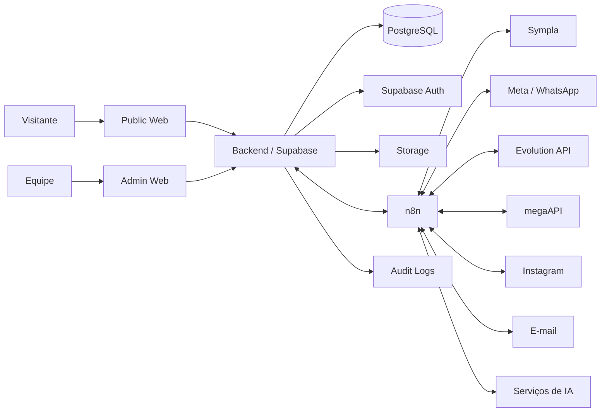

# Arquitetura — Instituto Serrana Digital

# 1. Princípios

1. Separar portal público e administração.
2. Compartilhar Design System e tipos.
3. Back-end orientado a domínios.
4. Integrações externas atrás de adapters.
5. Banco como fonte de verdade interna.
6. Sympla como fonte de verdade das vendas na fase inicial.
7. Mensageria multiprovedor.
8. Segurança por padrão.
9. Observabilidade desde o início.
10. Implementação incremental.

---

# 2. Stack proposta

## Front-end

- Next.js;
- React;
- TypeScript;
- Tailwind CSS;
- shadcn/ui;
- React Hook Form;
- Zod;
- TanStack Query;
- GSAP + ScrollTrigger;
- biblioteca de gráficos compatível com React;
- Playwright.

## Back-end

- Supabase Cloud;
- PostgreSQL;
- Supabase Auth;
- Supabase Storage;
- Row Level Security;
- Edge Functions quando apropriado;
- Node.js/TypeScript para serviços específicos;
- n8n para orquestrações;
- Redis quando necessário para fila/cache.

## Design

- Penpot;
- Design Tokens;
- Penpot MCP;
- Claude Code / Cursor.

---

# 3. Monorepo

```text
instituto-serrana-digital/
├── apps/
│   ├── public-web/
│   └── admin-web/
│
├── packages/
│   ├── ui/
│   ├── design-tokens/
│   ├── database/
│   ├── auth/
│   ├── types/
│   ├── config/
│   └── analytics/
│
├── services/
│   ├── integrations/
│   ├── sympla-sync/
│   ├── messaging/
│   └── reporting/
│
├── supabase/
│   ├── migrations/
│   ├── seed/
│   └── functions/
│
├── docs/
│   ├── product/
│   ├── architecture/
│   ├── integrations/
│   ├── security/
│   └── decisions/
│
└── scripts/
```

---

# 4. Separação de aplicações

## `public-web`

Responsável por:

- portal;
- CMS público;
- home Santa Rita;
- projetos;
- eventos;
- Bolerata;
- SEO;
- analytics;
- CTA Sympla.

## `admin-web`

Responsável por:

- autenticação;
- dashboard;
- eventos;
- CRM;
- atendimento;
- financeiro;
- projetos;
- documentos;
- relatórios;
- configurações.

### Motivo

Deploy, autorização, performance e evolução podem ocorrer de forma independente, preservando componentes compartilhados.

---

# 5. Arquitetura de contexto



---

# 6. Domínios

> Visão de alto nível dos bounded contexts. O detalhamento em tabelas e campos
> está em `docs/architecture/02-data-model.md` — mantenha os dois em sincronia.

## 6.1. Identity

- usuário;
- perfil;
- papel;
- permissão;
- sessão;
- auditoria.

## 6.2. Content

- páginas;
- posts;
- mídia;
- publicação;
- SEO.

## 6.3. Events

- evento;
- edição;
- local;
- setor;
- planta;
- mesa;
- lugar;
- programação.

## 6.4. Ticketing Integration

- evento Sympla;
- apresentação;
- pedido;
- participante;
- ticket;
- check-in;
- estado de sync.

## 6.5. CRM

- contato;
- papel do contato;
- deal;
- pipeline;
- etapa;
- tarefa;
- nota;
- histórico.

## 6.6. Messaging

- canal;
- conta/provedor;
- conversa;
- mensagem;
- template;
- webhook;
- status.

## 6.7. Finance

- conta;
- centro de custo;
- categoria;
- lançamento;
- documento;
- fornecedor;
- contrato.

## 6.8. Projects

- projeto;
- meta;
- indicador;
- patrocinador;
- patrocínio;
- contrapartida;
- entrega;
- prestação de contas.

## 6.9. People

- vínculo;
- função;
- escala;
- contrato;
- treinamento;
- equipamento.

---

# 7. API interna

Preferência por camada tipada.

Exemplos:

```text
GET    /api/events
POST   /api/events
PATCH  /api/events/:id

GET    /api/event-editions
POST   /api/event-editions

POST   /api/integrations/sympla/sync
GET    /api/integrations/sympla/status

GET    /api/contacts
POST   /api/contacts
PATCH  /api/contacts/:id

GET    /api/deals
POST   /api/deals
PATCH  /api/deals/:id/stage

GET    /api/conversations
POST   /api/messages/send

GET    /api/finance/entries
POST   /api/finance/entries

GET    /api/projects
POST   /api/projects

GET    /api/reports/*
```

---

# 8. Integrações por ports/adapters

## 8.1. Messaging Provider

```ts
interface MessagingProvider {
  sendText(input): Promise<MessageResult>
  sendMedia(input): Promise<MessageResult>
  sendTemplate(input): Promise<MessageResult>
  markAsRead(input): Promise<void>
  normalizeWebhook(payload): NormalizedMessageEvent[]
  healthCheck(): Promise<ProviderHealth>
}
```

Implementações:

- `MetaWhatsAppProvider`;
- `EvolutionWhatsAppProvider`;
- `MegaApiWhatsAppProvider`.

## 8.2. Ticketing Provider

Inicial:

- `SymplaProvider`.

Responsabilidades:

- eventos;
- apresentações;
- pedidos;
- participantes;
- check-in;
- sync.

O domínio não deve depender do payload bruto da Sympla.

---

# 9. Sincronização Sympla

## 9.1. Estratégia

- cursor incremental;
- `updated_at`/campos equivalentes quando disponíveis;
- idempotência;
- upsert;
- checkpoints;
- retry;
- logs;
- reprocessamento.

## 9.2. Fonte de verdade

| Informação | Fonte |
|---|---|
| Pedido de venda | Sympla |
| Participante/ticket | Sympla |
| Check-in oficial | Sympla / integração |
| Contato CRM | Plataforma |
| Histórico de relacionamento | Plataforma |
| Receita gerencial consolidada | Plataforma derivada da Sympla + entradas internas |
| Mesa operacional ilustrada | Plataforma, respeitando estado oficial |

---

# 10. Home Santa Rita — arquitetura de front-end

## 10.1. Estratégia

Seção "pinned" controlada por scroll.

```text
scroll progress
      ↓
timeline normalizada 0..1
      ↓
video.currentTime / frames / transforms
      ↓
text states + header states
```

## 10.2. Requisitos

- asset desktop e mobile;
- fallback estático;
- `prefers-reduced-motion`;
- não bloquear scroll;
- carregamento progressivo;
- degradar graciosamente.

## 10.3. Implementação sugerida

- GSAP ScrollTrigger;
- HTML5 video;
- MP4/WebM;
- `requestAnimationFrame`;
- mídia separada por breakpoint.

---

# 11. Estado e dados no front-end

- TanStack Query para server state;
- formulários com React Hook Form + Zod;
- estado local simples com React;
- evitar store global sem necessidade;
- erros normalizados;
- feature flags para capacidades experimentais.

---

# 12. Autenticação e autorização

## 12.1. Autenticação

Supabase Auth.

## 12.2. Autorização

- RBAC;
- permissões granulares;
- RLS;
- validação no servidor;
- nunca depender apenas de ocultação no front-end.

## 12.3. Escopo

`organization_id` em entidades internas para isolamento e evolução futura.

---

# 13. Banco

PostgreSQL com:

- UUID;
- timestamps;
- soft delete quando necessário;
- auditabilidade;
- constraints;
- índices;
- foreign keys;
- migrations versionadas.

---

# 14. Storage

Buckets separados por finalidade:

```text
public-media
institutional-documents
event-assets
financial-documents
contracts
project-evidence
avatars
```

Políticas específicas por bucket.

---

# 15. n8n

Utilizar para:

- sync periódico;
- webhooks;
- notificações;
- automações;
- IA;
- tarefas programadas;
- integração com serviços não críticos de baixa latência.

Evitar colocar regras centrais de autorização ou lógica financeira crítica apenas no n8n.

---

# 16. Filas e Redis

Usar quando houver necessidade concreta:

- processamento de mensagens;
- retries;
- rate limits;
- jobs;
- geração de relatórios.

Não adicionar complexidade antes do volume justificar.

---

# 17. Ambientes

```text
development
staging
production
```

Cada ambiente deve possuir:

- banco/namespace apropriado;
- secrets próprios;
- integrações configuradas separadamente;
- logs.

---

# 18. Deploy

Requisitos:

- container-ready;
- GitHub;
- CI/CD;
- migrations controladas;
- rollback;
- health check;
- monitoramento.

O destino final pode ser VPS/Coolify ou serviço gerenciado, devendo ser confirmado antes da fase de deploy.

---

# 19. CI/CD

Pipeline mínimo:

```text
lint
→ typecheck
→ unit tests
→ integration tests
→ build
→ migrations check
→ deploy staging
→ E2E
→ deploy production
```

---

# 20. Observabilidade

- application logs;
- audit logs;
- integration logs;
- error tracking;
- sync dashboard;
- health endpoints;
- alertas;
- métricas de Web Vitals.

---

# 21. Backup e recuperação

- backup PostgreSQL;
- backup Storage;
- retenção definida;
- restauração testada;
- migrações reversíveis quando possível;
- exportação periódica dos dados críticos.

---

# 22. Testes

## Unit

- normalizadores;
- regras;
- adapters;
- validação.

## Integration

- database;
- Sympla;
- messaging mock;
- RLS.

## E2E

- login;
- evento;
- CRM;
- sync;
- financeiro;
- check-in;
- CMS.

## Visual

- principais telas;
- breakpoints;
- comparação com Penpot.

---

# 23. ADRs

Os registros vivem em `docs/architecture/decisions/` (índice em
`decisions/README.md`). Já existem como stub, a preencher:

1. ADR-0001 — duas aplicações versus uma *(aceita)*;
2. ADR-0002 — Supabase Cloud *(proposta)*;
3. ADR-0003 — Sympla como fonte de venda *(aceita)*;
4. ADR-0004 — abstração multiprovedor de WhatsApp *(aceita)*;
5. ADR-0005 — Penpot como fonte visual *(aceita)*;
6. ADR-0006 — estratégia de deploy *(proposta)*;
7. ADR-0007 — modelo de contato unificado *(aceita)*;
8. ADR-0008 — política de IA *(aceita)*.

Novas mudanças arquiteturais relevantes exigem um novo ADR (ver `CLAUDE.md`).

---

# 24. Critérios arquiteturais de aceite

- nenhum segredo commitado;
- autorização validada no back-end/RLS;
- integrações desacopladas;
- migrations versionadas;
- logs;
- retries;
- source-of-truth definido;
- testes essenciais;
- documentação atualizada.
