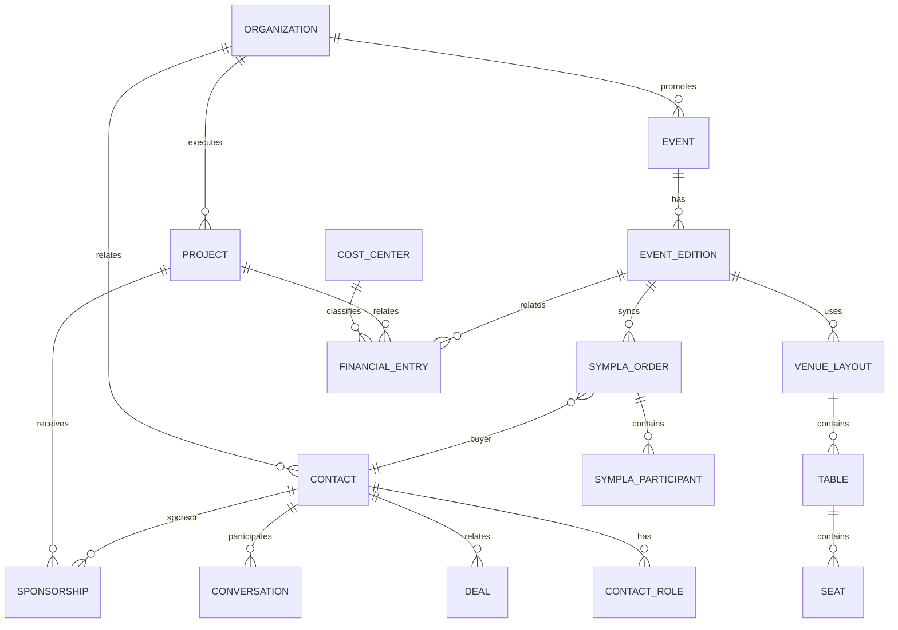

# Modelo de Dados

> Detalha os domínios de `docs/architecture/01-architecture.md` §6 em tabelas e
> campos. A entidade canônica de contato é o ADR-0007.

# 1. Princípio

Uma pessoa ou organização não deve ser duplicada em módulos diferentes.

Criar entidade canônica de relacionamento.

---

# 2. Organização

```text
organizations
- id
- name
- slug
- legal_name
- document
- status
- created_at
```

Inicialmente:

```text
Instituto Serrana ONG
```

---

# 3. Usuários

```text
users
profiles
roles
permissions
user_roles
```

---

# 4. Contatos

```text
contacts
- id
- organization_id
- type: person | organization
- name
- email
- phone
- instagram
- city
- state
- source
- status
- created_at
```

## Papéis

```text
contact_roles
- contact_id
- role
```

Papéis:

```text
buyer
participant
donor
sponsor
partner
volunteer
supplier
staff
artist
service_provider
```

---

# 5. CRM

```text
pipelines
pipeline_stages
deals
deal_contacts
tasks
notes
contact_tags
contact_tag_links
```

---

# 6. Eventos

```text
events
event_editions
venues
venue_layouts
sectors
tables
seats
event_staff
event_sponsors
```

---

# 7. Sympla

```text
sympla_events
sympla_presentations
sympla_orders
sympla_participants
sympla_checkins
sympla_sync_state
```

Campos relevantes:

```text
external_id
event_id
presentation_id
order_id
buyer_email
participant_email
sector_name
marked_place_name
ticket_number
ticket_status
sale_price
net_value
utm_source
checkin_at
external_updated_at
synced_at
```

---

# 8. Mapa

```text
venue_layouts
- id
- event_edition_id
- name
- version
- layout_type
- canvas_json
- status

tables
- id
- layout_id
- number
- label
- capacity
- sector_id
- x
- y
- rotation
- status

seats
- id
- table_id
- number
- status
```

---

# 9. Messaging

```text
channels
provider_accounts
conversations
conversation_participants
messages
message_status_events
message_templates
webhook_events
```

---

# 10. Financeiro

```text
financial_accounts
cost_centers
financial_categories
financial_entries
suppliers
invoices
contracts
financial_attachments
```

`financial_entries`:

```text
id
organization_id
type: payable | receivable
status
description
amount
due_date
paid_at
cost_center_id
category_id
contact_id
project_id
event_edition_id
sympla_order_id
created_by
```

---

# 11. Projetos

```text
projects
project_goals
project_indicators
project_members
sponsors
sponsorships
deliverables
accountability_items
```

---

# 12. Pessoas / RH

Evitar duplicar cadastro básico.

```text
staff_profiles
staff_assignments
work_schedules
training_records
equipment_assignments
```

Todos vinculados a `contacts`.

---

# 13. Documentos

```text
documents
document_categories
document_links
```

`document_links` permite ligar o arquivo a:

- projeto;
- evento;
- financeiro;
- contato;
- contrato;
- patrocínio.

---

# 14. Auditoria

```text
audit_logs
integration_logs
notifications
```

---

# 15. Relações



---

# 16. Regras

- unique constraints para external IDs;
- upsert idempotente;
- `organization_id` nas entidades internas;
- RLS;
- timestamps;
- migrations;
- audit em operações sensíveis.
