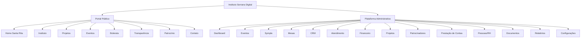
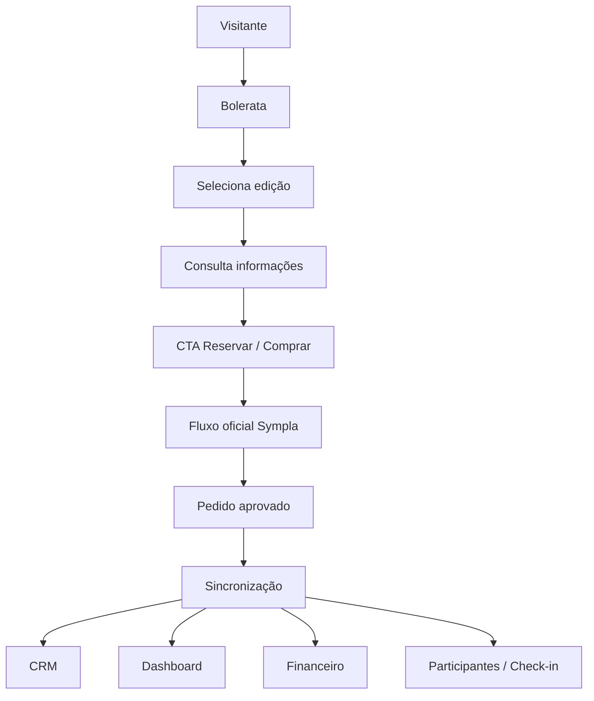

# PRD — Instituto Serrana Digital

## 1. Resumo executivo

O **Instituto Serrana Digital** será um ecossistema web responsivo composto por:

1. **Portal Público Institucional e Cultural**;
2. **Plataforma Administrativa de Acesso Restrito**.

O produto deverá centralizar presença institucional, projetos, eventos, Bolerata, CRM, atendimento, integrações, finanças, patrocínios, prestação de contas, documentos, pessoas e relatórios.

A **Bolerata** será o primeiro grande caso de uso operacional, permitindo validar:

- divulgação de eventos;
- integração com Sympla;
- acompanhamento de pedidos e participantes;
- visualização de mesas e lugares;
- CRM e relacionamento;
- atendimento por WhatsApp e Instagram;
- dashboard de receita e ocupação;
- operação de check-in.

O projeto será iniciado **antes da conclusão da descoberta**, por meio de um protótipo conceitual no Penpot. A reunião com o Instituto servirá para validar e lapidar uma proposta concreta, não para iniciar do zero.

---

# 2. Contexto institucional

## 2.1. Dados públicos já identificados

**CONFIRMADO por conteúdo institucional público:**

- o Instituto Serrana ONG é uma organização civil privada, sem fins lucrativos e apartidária;
- o site institucional informa criação em 27 de setembro de 2001;
- sua atuação abrange o Serro e adjacências;
- o conteúdo público relaciona a atuação a desenvolvimento sustentável, econômico, social, turístico, ambiental e cultural;
- o Instituto possui iniciativas em patrimônio material e imaterial, memória, cultura, pesquisa, publicações, eventos e desenvolvimento local.

## 2.2. Missão — base institucional

O site atual já publica missão institucional.

### Proposta editorial para o novo portal

> Promover qualidade de vida, fortalecer direitos, fomentar a economia criativa e desenvolver ações integradas à cultura, à memória e ao patrimônio do Serro e de sua região.

**Status:** `PROPOSTA DE REDAÇÃO`.  
Deve ser validada com o Instituto antes da publicação.

## 2.3. Visão do produto digital

> Conectar cultura, patrimônio, comunidade, eventos e gestão institucional em uma plataforma digital única, capaz de ampliar a presença pública do Instituto e profissionalizar seus processos internos.

---

# 3. Identidade do produto

## 3.1. Nome

**DECISÃO DE TRABALHO:** `Instituto Serrana Digital`.

Distinção:

- **Instituto Serrana ONG** — entidade;
- **Instituto Serrana Digital** — plataforma digital.

## 3.2. Domínio

**Domínio desejado:** `www.institutoserrana.org.br`.

**Observação:** o site público atualmente encontrado utiliza `institutoserrana.org`. A disponibilidade, titularidade e migração para `.org.br` devem ser confirmadas antes do deploy.

## 3.3. Subdomínio administrativo

Proposta:

```text
app.institutoserrana.org.br
```

ou equivalente no domínio definitivamente aprovado.

---

# 4. Problemas a resolver

## 4.1. Público

- presença digital institucional fragmentada;
- pouca integração entre narrativa cultural, projetos e eventos;
- dificuldade de transformar descoberta cultural em relacionamento;
- dependência de plataformas externas para parte da experiência de eventos;
- necessidade de comunicar impacto, transparência e patrocinadores.

## 4.2. Administrativo

- dados distribuídos em ferramentas, planilhas e mensagens;
- baixa visão consolidada de eventos, clientes, receitas e despesas;
- atendimento sem histórico centralizado;
- necessidade de acompanhar vendas da Sympla sem operar apenas dentro da Sympla;
- necessidade de centralizar documentos, projetos e prestação de contas;
- ausência de uma visão 360º das pessoas e organizações relacionadas ao Instituto.

---

# 5. Objetivos do produto

## 5.1. Objetivos primários

1. Criar uma presença institucional contemporânea e culturalmente relevante.
2. Transformar a Igreja de Santa Rita e a escadaria em narrativa visual de entrada.
3. Dar à Bolerata uma experiência digital própria.
4. Integrar dados da Sympla ao ambiente administrativo.
5. Centralizar CRM e atendimento.
6. Disponibilizar visão executiva de eventos e financeiro.
7. Estruturar projetos, patrocinadores e prestação de contas.
8. Criar base escalável para outros eventos e projetos do Instituto.

## 5.2. Objetivos secundários

- melhorar rastreabilidade de origem das vendas;
- aumentar capacidade de relacionamento pós-evento;
- criar memória digital das interações;
- reduzir trabalho manual;
- apoiar diretoria e equipe com indicadores;
- facilitar transparência e comunicação institucional.

---

# 6. Não objetivos do MVP

O MVP **não** pretende:

- substituir o sistema contábil oficial;
- substituir integralmente a Sympla;
- criar checkout próprio antes de decisão específica;
- implementar folha de pagamento;
- automatizar emissão fiscal sem análise do sistema municipal/contábil;
- publicar missão, visão ou textos institucionais não aprovados;
- operar uma API não oficial de WhatsApp como única dependência crítica;
- construir app nativo iOS/Android inicialmente.

---

# 7. Públicos e perfis

## 7.1. Público externo

- moradores do Serro e região;
- turistas;
- público da Bolerata;
- compradores e participantes;
- patrocinadores;
- parceiros;
- imprensa;
- pesquisadores;
- apoiadores;
- potenciais doadores.

## 7.2. Usuários internos

- diretoria;
- administração;
- produção de eventos;
- comercial;
- atendimento;
- financeiro;
- projetos;
- comunicação;
- RH/pessoas;
- contador;
- auditor/leitura.

---

# 8. Arquitetura funcional



---

# 9. Portal público

## 9.1. Home — experiência Santa Rita

### Requisito PUB-001 — ponto inicial

A experiência deve iniciar **na parte inferior da escadaria**, com a Igreja de Santa Rita visível ao fundo.

### Requisito PUB-002 — scroll narrativo

Ao rolar a página, o visitante deve ter a sensação de **subir progressivamente a escadaria** até a igreja.

Sequência conceitual:

```text
Cidade
→ Comunidade
→ Memória
→ Cultura
→ Patrimônio
→ Instituto
```

### Requisito PUB-003 — foco

A igreja deve permanecer como referência focal durante a experiência.

### Requisito PUB-004 — narrativa progressiva

Textos curtos e discretos devem introduzir:

- memória;
- cultura;
- patrimônio;
- comunidade;
- atuação institucional.

### Requisito PUB-005 — chegada

Ao final da subida, estabilizar a composição diante da igreja e apresentar a identidade do Instituto.

### Requisito PUB-006 — acessibilidade

Com `prefers-reduced-motion`, substituir a experiência por:

- imagem estática;
- textos equivalentes;
- navegação convencional.

## 9.2. Seções seguintes

### PUB-010 — Instituto

- história;
- missão;
- visão;
- valores;
- diretoria;
- atuação.

### PUB-011 — Áreas de atuação

Proposta inicial:

- patrimônio material;
- patrimônio imaterial;
- memória;
- cultura;
- música;
- turismo sustentável;
- economia criativa;
- pesquisa e educação patrimonial;
- desenvolvimento local.

### PUB-012 — Projetos

Cada projeto terá:

- título;
- objetivo;
- descrição;
- período;
- parceiros;
- patrocinadores;
- indicadores;
- galeria;
- documentos públicos;
- resultados.

### PUB-013 — Eventos

- agenda;
- eventos futuros;
- eventos passados;
- página individual;
- localização;
- programação;
- CTA.

### PUB-014 — Transparência

- estatuto;
- relatórios;
- atas;
- convênios;
- documentos;
- prestações de contas publicáveis.

### PUB-015 — Contato e relacionamento

- WhatsApp;
- Instagram;
- e-mail;
- formulário;
- consentimentos de privacidade.

---

# 10. Bolerata

## 10.1. Página temática

A Bolerata terá identidade própria, mantendo vínculo com o Design System institucional.

### BOL-001 — Hero

- arte/fotografia/vídeo;
- próxima edição;
- data;
- local;
- CTA de reserva.

### BOL-002 — Temporada

Exibir todas as edições da temporada, com situação e CTA.

### BOL-003 — Página de edição

- data;
- horário;
- local;
- programação;
- artistas;
- acessibilidade;
- FAQ;
- patrocinadores;
- reserva/compra.

### BOL-004 — Galeria

Fotos e vídeos organizados por edição.

## 10.2. Mapa de mesas

Serão criados dois conceitos.

### BOL-MAP-A — Mapa urbano ilustrado

Vista superior estilizada do espaço real:

- rua;
- calçamento;
- casarões;
- palco/pontos de música;
- vegetação;
- circulação;
- mesas;
- referências arquitetônicas.

Finalidade:

- apresentação pública;
- impacto visual;
- narrativa do evento.

### BOL-MAP-B — Planta operacional

Vista técnica:

- mesas numeradas;
- setores;
- capacidades;
- circulação;
- áreas técnicas;
- bloqueios;
- acessibilidade;
- estados.

Finalidade:

- equipe;
- administração;
- velocidade operacional.

### Estados visuais propostos

| Estado | Uso |
|---|---|
| Disponível | mesa/lugar livre |
| Pendente | aguardando confirmação |
| Vendida | pedido aprovado |
| Cortesia | convidado/patrocinador |
| Bloqueada | não comercializável |
| Check-in | presença registrada |

> O estado comercial oficial deve respeitar a fonte de verdade da Sympla enquanto ela permanecer responsável pela venda.

---

# 11. Jornada de compra e Sympla



### SYM-001

A Sympla será a **fonte oficial de venda e emissão de ingresso na primeira etapa**.

### SYM-002

A plataforma deverá importar e normalizar:

- eventos;
- apresentações;
- setores;
- pedidos;
- compradores;
- participantes;
- ticket;
- valores bruto/líquido;
- status;
- UTM;
- check-in;
- `marked_place_name`, quando disponível.

### SYM-003

A plataforma não deverá presumir existência de endpoint público para:

- criar pedido;
- reservar/segurar lugar;
- processar checkout;
- alterar lugar marcado.

Tais capacidades só poderão ser implementadas após confirmação documental/contratual.

---

# 12. Plataforma administrativa

## 12.1. Autenticação

### AUTH-001

- login por e-mail;
- recuperação;
- MFA para perfis sensíveis;
- sessão segura;
- RBAC;
- auditoria.

## 12.2. Dashboard

### DASH-001 — visão executiva

Exibir, conforme permissão:

- próxima edição;
- ocupação;
- receita bruta;
- receita líquida;
- despesas;
- resultado;
- pedidos;
- atendimento;
- falhas de integração;
- tarefas;
- atividade recente.

### Princípio

> Mostrar primeiro “o que está acontecendo agora” e “o que precisa de atenção”.

Evitar excesso de gráficos decorativos.

## 12.3. Eventos

### EVT-001

- temporadas;
- eventos;
- edições;
- locais;
- programação;
- equipe;
- fornecedores;
- documentos;
- checklists;
- custos;
- patrocinadores.

## 12.4. Mesas

### MAP-001

- planta;
- filtros;
- zoom;
- status;
- seleção;
- painel lateral;
- vínculo com comprador/pedido;
- histórico.

## 12.5. CRM

### CRM-001 — pipeline

```text
Novo
→ Atendimento iniciado
→ Interesse identificado
→ Edição selecionada
→ Opções apresentadas
→ Link enviado
→ Aguardando compra
→ Compra identificada
→ Pós-venda
→ Check-in
→ Relacionamento futuro
```

### CRM-002 — visão 360º

O mesmo contato poderá acumular papéis:

- comprador;
- participante;
- doador;
- patrocinador;
- parceiro;
- voluntário;
- prestador;
- membro de equipe.

### CRM-003 — ficha

- dados básicos;
- canais;
- tags;
- origem;
- consentimentos;
- histórico;
- conversas;
- eventos;
- compras;
- tarefas;
- notas;
- resumo de IA.

## 12.6. Atendimento omnichannel

### MSG-001

Canais:

- WhatsApp;
- Instagram;
- formulário web;
- e-mail;
- atendimento manual.

### MSG-002

Tela deverá incluir:

- fila;
- conversa;
- contato;
- CRM;
- resumo por IA;
- tarefas;
- respostas rápidas;
- transferência para humano;
- anexos;
- notas internas.

## 12.7. IA

### AI-001 — capacidades

- FAQ;
- datas;
- locais;
- edição;
- coleta de contato;
- resumo;
- classificação;
- sugestão de resposta;
- encaminhamento;
- pós-venda;
- relatórios.

### AI-002 — restrições

IA não poderá autonomamente:

- conceder desconto;
- alterar preço;
- aprovar reembolso;
- movimentar recursos;
- emitir nota fiscal;
- assumir decisão jurídica;
- executar mudança crítica sem autorização.

## 12.8. Financeiro

### FIN-001 — finalidade

Gestão interna gerencial, **não substituindo contabilidade oficial**.

### Centros de custo

- Instituto;
- Bolerata;
- projetos;
- eventos;
- administração;
- patrocínios.

### Funções

- contas a pagar;
- contas a receber;
- receitas;
- despesas;
- anexos;
- comprovantes;
- notas;
- categorias;
- relatórios;
- previsto x realizado.

## 12.9. Projetos e patrocínios

### PRJ-001

- projeto;
- objetivo;
- cronograma;
- orçamento;
- metas;
- indicadores;
- equipe;
- patrocinadores;
- contrapartidas;
- entregas;
- documentos;
- prestação de contas.

## 12.10. Pessoas / RH

### HR-001

- funcionários;
- prestadores;
- artistas;
- músicos;
- brigadistas;
- voluntários;
- produtores.

### HR-002

- função;
- contrato;
- escala;
- evento;
- valor;
- pagamento;
- documentos;
- treinamento;
- alertas.

## 12.11. Documentos

### DOC-001

Documentos vinculados às entidades corretas:

- projeto;
- pessoa;
- evento;
- financeiro;
- patrocinador;
- fornecedor;
- contrato.

Evitar um repositório sem contexto.

## 12.12. Relatórios

### RPT-001

- vendas;
- ocupação;
- público;
- check-in;
- financeiro;
- canais;
- CRM;
- projetos;
- patrocinadores;
- documentos pendentes;
- auditoria.

---

# 13. CMS e conteúdo

## CMS-001

Conteúdos editáveis pela equipe:

- páginas;
- hero;
- eventos;
- projetos;
- notícias;
- patrocinadores;
- FAQ;
- documentos;
- contatos.

## CMS-002 — fluxo

```text
Rascunho → Revisão → Aprovação → Publicado → Arquivado
```

---

# 14. Analytics

## ANALYTICS-001

Rastrear:

- origem;
- campanha;
- página;
- edição;
- CTA;
- clique em compra;
- dispositivo;
- conversões identificáveis;
- canal CRM.

## ANALYTICS-002

Preservar UTM da Sympla quando disponibilizada pela API.

---

# 15. Perfis e permissões

| Perfil | Escopo |
|---|---|
| Superadmin | acesso total |
| Diretoria | visão executiva e aprovações |
| Financeiro | financeiro e documentos |
| Eventos | operação de eventos |
| Comercial | CRM |
| Atendimento | conversas e contatos |
| Check-in | participantes/check-in |
| Projetos | projetos e patrocínios |
| RH | pessoas e escalas |
| Comunicação | CMS e conteúdo |
| Contador | relatórios/documentos financeiros |
| Auditor | leitura |

---

# 16. Requisitos não funcionais

## NFR-SEC-001 — segurança

- RLS;
- RBAC;
- MFA;
- logs;
- segredo fora do código;
- princípio do menor privilégio.

## NFR-PERF-001 — performance

- lazy loading;
- otimização de mídia;
- WebM/MP4;
- imagens responsivas;
- cache;
- Core Web Vitals.

## NFR-A11Y-001 — acessibilidade

Objetivo: WCAG 2.2 AA nas principais jornadas.

- teclado;
- contraste;
- labels;
- foco;
- reduced motion;
- alt text;
- sem dependência exclusiva de cor.

## NFR-OBS-001 — observabilidade

- logs;
- erros;
- métricas;
- falhas de integração;
- status de sync;
- alertas.

## NFR-RESP-001 — responsividade

Desktop, tablet e mobile.

---

# 17. Métricas de sucesso

## Produto público

- taxa de clique em eventos;
- taxa de clique em reserva;
- engajamento com projetos;
- retorno de visitantes;
- desempenho e acessibilidade.

## Evento

- ocupação;
- receita;
- ticket médio;
- comparecimento;
- origem;
- conversão.

## CRM

- tempo de primeira resposta;
- conversão por canal;
- contatos recorrentes;
- follow-ups concluídos.

## Operação

- tempo de sincronização;
- taxa de falhas;
- tempo de resolução;
- redução de planilhas/processos manuais.

---

# 18. MVP

## Público

- Home Santa Rita;
- Instituto;
- projetos;
- eventos;
- Bolerata;
- edição;
- CTA Sympla;
- contato;
- transparência básica.

## Administrativo

- autenticação;
- dashboard;
- eventos;
- Sympla;
- CRM;
- atendimento básico;
- financeiro básico;
- documentos;
- relatórios essenciais.

## Protótipo da reunião

Antes mesmo do MVP funcional:

1. Home Santa Rita;
2. Instituto;
3. Projetos;
4. Bolerata;
5. Edição;
6. mapa urbano;
7. mapa operacional;
8. login;
9. dashboard;
10. CRM;
11. financeiro;
12. mobile.

---

# 19. Discovery como gate de validação

A reunião deverá confirmar ou revisar:

- nome e posicionamento;
- missão/visão/valores;
- arquitetura de informação;
- ferramentas atuais;
- operação de mesas;
- contrato Sympla;
- usuários;
- financeiro;
- documentos;
- WhatsApp/Meta;
- conteúdo;
- prioridades do MVP.

O protótipo será usado como instrumento de descoberta.

---

# 20. Critérios de aceite do PRD

O PRD estará apto para desenvolvimento quando:

- hipóteses críticas estiverem classificadas;
- MVP estiver aprovado;
- arquitetura for aceita;
- integrações mínimas forem confirmadas;
- modelo de acesso estiver validado;
- Design System inicial estiver aprovado;
- principais jornadas tiverem critérios de aceite;
- nenhuma capacidade externa incerta for tratada como garantida.

---

# 21. Referências oficiais

Verificadas em 2026-09-04:

- Instituto Serrana: https://www.institutoserrana.org/
- História/Missão: https://www.institutoserrana.org/nossa-historia
- Projetos: https://www.institutoserrana.org/projetos
- Termo de fomento com a Prefeitura do Serro (restauro/preservação de bens públicos): https://www.serro.mg.gov.br/portal/noticias/0/3/2813/o-municipio-de-serromg-celebra-termo-de-fomento-com-o-instituto-serrana-ong-para-restaurar-e-preservar-bens-publicos
- Sympla Developer Portal: https://developers.sympla.com.br/api-doc/
- Sympla OpenAPI: https://developers.sympla.com.br/api-docs
- Meta WhatsApp Business Platform: https://developers.facebook.com/documentation/business-messaging/whatsapp/about-the-platform
- Evolution API: https://github.com/evolution-foundation/evolution-api
- megaAPI: https://megaapi.io/
